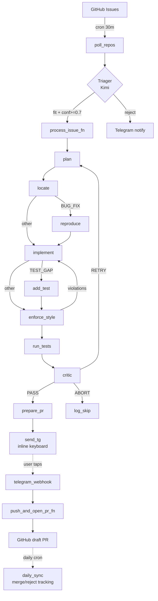

# Phase 2 — Full Agent System Implementation Plan (no-TDD edition)

> **For agentic workers:** REQUIRED SUB-SKILL: Use superpowers:subagent-driven-development (recommended) or superpowers:executing-plans to implement this plan task-by-task. Steps use checkbox (`- [ ]`) syntax for tracking.

**Goal:** Extend Phase 1 with the complete agent system: LangGraph orchestration of all 4 lanes (TYPO / DEPRECATION / TEST_GAP / BUG_FIX), AST-based code locator (tree-sitter), `reproduce` and `add_test` nodes, deterministic style enforcement, Critic with refusal, Telegram single-click approval, GitHub draft PR opening, daily PR status sync, stale draft cleanup, evaluation harness with single-shot baseline, and a recruiter-grade README with real numbers.

**Architecture:** Modal worker (`process_issue`) with budget/idempotency guards → LangGraph state machine of 11 nodes (load_context → plan → locate → reproduce? → implement → add_test? → enforce_style → run_tests → critic → prepare_pr → send_tg) → Telegram webhook for callbacks → `push_and_open_pr` after approval. Two daily crons: PR status sync (for headline merge-rate metric) and stale-draft cleanup. A separate eval pipeline runs the agent against a 100-PR labeled set and produces a metrics report.

**Tech Stack additions:** LangGraph 0.2+, tree-sitter + tree-sitter-python, `gh` CLI, ripgrep, subprocess pytest, scrape-and-replay eval harness.

**Scope:** Everything from the spec's roadmap Phase 2-5 in one plan. **25 tasks.** Without TDD this is feasible across ~4-6 weekends of focused work.

**Testing policy:** No unit tests written in this plan — deferred to a Phase 2.5 hardening pass after end-to-end runs. Each task verifies via import check, lint, and integration smoke test.

---

## Prerequisites

- Phase 1 deployed and running cleanly for ≥3 days
- All credentials in place (Modal account, Moonshot/Kimi key, GitHub PAT for `koala25`, Telegram bot token + user ID)
- Forks exist under `koala25` for each watched repo (or use direct upstream pushes if you have write access — unlikely for big OSS repos)
- 2-3 real issues from `langchain-ai/langchain` you'd want to use as test cases (one per classification ideally)

---

## File Structure (after Phase 2)

```
mend-pilot/
├── pyproject.toml
├── .pre-commit-config.yaml
├── README.md
├── config/
│   ├── models.yaml
│   └── watched_repos.yaml
├── docs/
│   └── architecture.png         # generated in Task 25
├── eval/
│   ├── dataset.jsonl            # 100 labeled examples (Task 21)
│   ├── runner.py                # eval entry point (Task 22)
│   └── baseline.py              # single-shot baseline (Task 23)
└── src/ossagent/
    ├── (Phase 1 files)
    ├── agent/
    │   ├── __init__.py
    │   ├── state.py
    │   ├── context.py
    │   ├── context_extractor.py    # LLM convention extraction (Task 18)
    │   ├── tools.py
    │   ├── ast_locator.py          # tree-sitter AST queries (Task 13)
    │   ├── nodes.py                # all 11 node functions
    │   └── graph.py
    ├── worker.py
    ├── webhook.py
    ├── pr_creator.py
    └── crons.py                    # daily PR sync, stale cleanup (Tasks 19-20)
```

---

## Task 1: Add Phase 2 deps

**Files:**
- Modify: `pyproject.toml`

- [ ] **Step 1: Add deps to `pyproject.toml`**

Append to `dependencies`:

```toml
"langgraph>=0.2.50",
"langgraph-checkpoint-sqlite>=2.0",
"tree-sitter>=0.23",
"tree-sitter-python>=0.23",
"PyGithub>=2.5",         # used by daily PR status sync
```

- [ ] **Step 2: Re-sync**

```bash
uv pip install -e ".[dev]"
```

- [ ] **Step 3: Commit**

```bash
git add pyproject.toml
git commit -m "chore: Phase 2 deps (langgraph, tree-sitter, PyGithub)"
```

---

## Task 2: AgentState + supporting dataclasses

**Files:**
- Create: `src/ossagent/agent/__init__.py`, `src/ossagent/agent/state.py`

- [ ] **Step 1: Create subpackage**

```bash
mkdir -p src/ossagent/agent
touch src/ossagent/agent/__init__.py
```

- [ ] **Step 2: Write `src/ossagent/agent/state.py`**

```python
"""Type definitions for the LangGraph agent state."""
from __future__ import annotations
from dataclasses import dataclass
from pathlib import Path
from typing import Literal, TypedDict
from ossagent.github_client import Issue


@dataclass(frozen=True)
class PlanStep:
    number: int
    description: str


@dataclass(frozen=True)
class TargetFile:
    path: str
    line_range: tuple[int, int]
    why: str


@dataclass(frozen=True)
class TestRunResult:
    passed: bool
    failed_tests: list[str]
    stdout_tail: str
    stderr_tail: str


@dataclass(frozen=True)
class StyleViolation:
    tool: str
    file: str
    message: str


@dataclass(frozen=True)
class PRMetadata:
    title: str
    body: str
    branch_name: str
    head_owner: str
    base_branch: str


CriticVerdict = Literal["PASS", "RETRY", "ABORT"]
Classification = Literal["TYPO", "DEPRECATION", "TEST_GAP", "BUG_FIX"]


class AgentState(TypedDict, total=False):
    # Input
    issue_url: str
    repo_url: str
    classification: Classification
    attempt_id: str

    # Loaded
    issue: Issue
    repo_path: Path
    repo_context: "RepoContext"  # forward ref

    # Planning / locating
    plan: list[PlanStep]
    target_files: list[TargetFile]

    # Reproduction (BUG_FIX)
    failing_test_path: str | None
    failing_test_output: str | None

    # Implementation
    patch: str

    # Validation
    style_violations: list[StyleViolation]
    style_retry_count: int
    test_run: TestRunResult
    critic_verdict: CriticVerdict
    critic_reasoning: str
    confidence: float

    # Bookkeeping
    retry_count: int
    cost_so_far: float
    skip_reason: str

    # Output
    pr_metadata: PRMetadata
```

- [ ] **Step 3: Verify import**

```bash
.venv/bin/python -c "from ossagent.agent.state import AgentState, PRMetadata, Classification; print('ok')"
```

- [ ] **Step 4: Commit**

```bash
git add src/ossagent/agent/
git commit -m "feat(agent): AgentState + supporting dataclasses"
```

---

## Task 3: Helper utilities (git, diff, search)

**Files:**
- Create: `src/ossagent/agent/tools.py`

- [ ] **Step 1: Write `src/ossagent/agent/tools.py`**

```python
"""Deterministic helpers: git, diff application, ripgrep, file windowing."""
from __future__ import annotations
import subprocess
from pathlib import Path


def git(*args: str, cwd: Path, check: bool = True) -> subprocess.CompletedProcess:
    return subprocess.run(
        ["git", *args], cwd=cwd, capture_output=True, text=True, check=check,
    )


def shallow_clone_or_pull(repo_url: str, dest: Path) -> Path:
    if dest.exists() and (dest / ".git").exists():
        git("fetch", "--depth", "1", "origin", cwd=dest)
        git("reset", "--hard", "origin/HEAD", cwd=dest)
    else:
        dest.parent.mkdir(parents=True, exist_ok=True)
        subprocess.run(
            ["git", "clone", "--depth", "1", repo_url, str(dest)], check=True,
        )
    return dest


def create_branch(repo_path: Path, branch_name: str) -> None:
    git("checkout", "-B", branch_name, cwd=repo_path)


def apply_unified_diff(repo_path: Path, diff_text: str) -> None:
    proc = subprocess.run(
        ["git", "apply", "--whitespace=nowarn", "-"],
        cwd=repo_path, input=diff_text, text=True, capture_output=True,
    )
    if proc.returncode != 0:
        raise RuntimeError(f"git apply failed:\n{proc.stdout}\n{proc.stderr}")


def stage_and_commit(repo_path: Path, message: str) -> None:
    git("add", "-A", cwd=repo_path)
    git("commit", "-m", message, cwd=repo_path)


def ripgrep(repo_path: Path, pattern: str, *, max_results: int = 50) -> list[str]:
    try:
        out = subprocess.run(
            ["rg", "--no-heading", "-n", pattern, str(repo_path)],
            capture_output=True, text=True, timeout=30,
        )
    except FileNotFoundError:
        out = subprocess.run(
            ["grep", "-rnE", pattern, str(repo_path)],
            capture_output=True, text=True, timeout=30,
        )
    return (out.stdout or "").splitlines()[:max_results]


def read_file_window(repo_path: Path, rel_path: str, line: int,
                     *, before: int = 30, after: int = 60) -> str:
    p = repo_path / rel_path
    lines = p.read_text(errors="replace").splitlines()
    start = max(0, line - before - 1)
    end = min(len(lines), line + after)
    return "\n".join(f"{i+1:5}| {lines[i]}" for i in range(start, end))
```

- [ ] **Step 2: Verify**

```bash
.venv/bin/python -c "from ossagent.agent.tools import shallow_clone_or_pull, apply_unified_diff, ripgrep; print('ok')"
```

- [ ] **Step 3: Commit**

```bash
git add src/ossagent/agent/tools.py
git commit -m "feat(agent): git/diff/search helpers"
```

---

## Task 4: Tree-sitter AST locator

**Files:**
- Create: `src/ossagent/agent/ast_locator.py`

- [ ] **Step 1: Write `src/ossagent/agent/ast_locator.py`**

```python
"""AST-based code location using tree-sitter-python."""
from __future__ import annotations
from dataclasses import dataclass
from pathlib import Path
from tree_sitter import Language, Parser
import tree_sitter_python as tspython


PY_LANGUAGE = Language(tspython.language())
PARSER = Parser(PY_LANGUAGE)


@dataclass(frozen=True)
class SymbolHit:
    path: str           # relative to repo root
    symbol: str         # e.g., "Foo.bar"
    kind: str           # "function" | "method" | "class"
    line_start: int     # 1-based
    line_end: int


def find_python_symbol(repo_path: Path, symbol_name: str,
                       *, max_results: int = 10) -> list[SymbolHit]:
    """Find function/method/class definitions matching `symbol_name` across .py files."""
    results: list[SymbolHit] = []
    for py_file in repo_path.rglob("*.py"):
        if any(part.startswith(".") for part in py_file.parts):
            continue   # skip hidden dirs (.venv, .git, etc.)
        try:
            text_bytes = py_file.read_bytes()
        except OSError:
            continue
        tree = PARSER.parse(text_bytes)
        for hit in _walk_for_symbol(tree.root_node, text_bytes, symbol_name):
            rel = py_file.relative_to(repo_path)
            results.append(SymbolHit(
                path=str(rel),
                symbol=hit["symbol"], kind=hit["kind"],
                line_start=hit["line_start"], line_end=hit["line_end"],
            ))
            if len(results) >= max_results:
                return results
    return results


def _walk_for_symbol(node, src_bytes: bytes, target: str, class_ctx: str = ""):
    """Yield {symbol, kind, line_start, line_end} for matching defs."""
    for child in node.children:
        if child.type == "class_definition":
            name = _identifier_child(child, src_bytes)
            if name == target:
                yield {
                    "symbol": name, "kind": "class",
                    "line_start": child.start_point[0] + 1,
                    "line_end": child.end_point[0] + 1,
                }
            yield from _walk_for_symbol(child, src_bytes, target, class_ctx=name or class_ctx)
        elif child.type == "function_definition":
            name = _identifier_child(child, src_bytes)
            qualified = f"{class_ctx}.{name}" if class_ctx else name
            if name == target or qualified == target:
                yield {
                    "symbol": qualified,
                    "kind": "method" if class_ctx else "function",
                    "line_start": child.start_point[0] + 1,
                    "line_end": child.end_point[0] + 1,
                }
            yield from _walk_for_symbol(child, src_bytes, target, class_ctx)
        else:
            yield from _walk_for_symbol(child, src_bytes, target, class_ctx)


def _identifier_child(def_node, src_bytes: bytes) -> str | None:
    for c in def_node.children:
        if c.type == "identifier":
            return src_bytes[c.start_byte:c.end_byte].decode("utf-8", errors="replace")
    return None
```

- [ ] **Step 2: Verify import and parse**

```bash
.venv/bin/python -c "
from pathlib import Path
from ossagent.agent.ast_locator import find_python_symbol
# Sanity check on the project's own source
hits = find_python_symbol(Path('.'), 'load_repo_context')
print(f'found {len(hits)} hits')
"
```

Expected: at least 1 hit once `context.py` from Task 5 exists, or 0 hits now (still ok).

- [ ] **Step 3: Commit**

```bash
git add src/ossagent/agent/ast_locator.py
git commit -m "feat(agent): tree-sitter AST locator for Python symbols"
```

---

## Task 5: RepoContext loader

**Files:**
- Create: `src/ossagent/agent/context.py`

- [ ] **Step 1: Write `src/ossagent/agent/context.py`**

```python
"""Per-repo conventions cache."""
from __future__ import annotations
import json
import subprocess
import tomllib
from dataclasses import asdict, dataclass, field
from datetime import datetime, timedelta, UTC
from pathlib import Path
import yaml


CACHE_ROOT = Path("/data/repo_context")
CACHE_TTL = timedelta(days=7)


@dataclass(frozen=True)
class RepoContext:
    repo_owner: str
    repo_name: str
    head_sha: str
    contributing_md: str | None
    readme_summary: str
    pr_template: str | None
    ruff_config: dict = field(default_factory=dict)
    mypy_config: dict = field(default_factory=dict)
    pre_commit_hooks: list[str] = field(default_factory=list)
    test_command: str = "pytest"
    style_notes: list[str] = field(default_factory=list)
    test_patterns: list[str] = field(default_factory=list)
    pr_norms: list[str] = field(default_factory=list)
    sample_test_excerpt: str = ""


def load_repo_context(
    repo_path: Path, owner: str, name: str,
    *, extractor=None,
) -> RepoContext:
    """Load or build the context. `extractor` is an optional async callable that
    takes (raw_contributing_text, raw_readme_text) and returns
    (style_notes, test_patterns, pr_norms, readme_summary)."""
    head_sha = _git_head_sha(repo_path)
    cache_dir = CACHE_ROOT / owner / name
    cache_dir.mkdir(parents=True, exist_ok=True)
    cache_file = cache_dir / f"{head_sha[:12]}.json"

    if cache_file.exists():
        age = datetime.now(UTC) - datetime.fromtimestamp(cache_file.stat().st_mtime, UTC)
        if age < CACHE_TTL:
            return RepoContext(**json.loads(cache_file.read_text()))

    contributing = _read_first(repo_path, [
        "CONTRIBUTING.md", ".github/CONTRIBUTING.md",
        "docs/contributing.md", "docs/en/docs/contributing.md",
    ])
    pr_template = _read_first(repo_path, [
        ".github/PULL_REQUEST_TEMPLATE.md", ".github/pull_request_template.md",
        "PULL_REQUEST_TEMPLATE.md",
    ])
    readme_raw = _read_first(repo_path, ["README.md", "README.rst"]) or ""
    pyproject = _parse_toml(repo_path / "pyproject.toml")
    pre_commit_hooks = _parse_pre_commit(repo_path / ".pre-commit-config.yaml")
    sample = _pick_sample_test(repo_path)

    style_notes: list[str] = []
    test_patterns: list[str] = []
    pr_norms: list[str] = []
    readme_summary = readme_raw[:1000]

    if extractor is not None:
        try:
            extracted = extractor(contributing or "", readme_raw)
            style_notes, test_patterns, pr_norms, readme_summary = extracted
        except Exception:
            pass  # best-effort; fall back to defaults

    ctx = RepoContext(
        repo_owner=owner, repo_name=name, head_sha=head_sha,
        contributing_md=_truncate(contributing, 24000),
        readme_summary=readme_summary,
        pr_template=pr_template,
        ruff_config=pyproject.get("tool", {}).get("ruff") or {},
        mypy_config=pyproject.get("tool", {}).get("mypy") or {},
        pre_commit_hooks=pre_commit_hooks,
        test_command="pytest",
        style_notes=style_notes, test_patterns=test_patterns, pr_norms=pr_norms,
        sample_test_excerpt=sample,
    )
    cache_file.write_text(json.dumps(asdict(ctx), default=str, indent=2))
    return ctx


def _git_head_sha(repo_path: Path) -> str:
    return subprocess.run(
        ["git", "rev-parse", "HEAD"], cwd=repo_path,
        capture_output=True, text=True, check=True,
    ).stdout.strip()


def _read_first(root: Path, candidates: list[str]) -> str | None:
    for rel in candidates:
        p = root / rel
        if p.is_file():
            return p.read_text(errors="replace")
    return None


def _parse_toml(path: Path) -> dict:
    if not path.exists():
        return {}
    try:
        return tomllib.loads(path.read_text())
    except tomllib.TOMLDecodeError:
        return {}


def _parse_pre_commit(path: Path) -> list[str]:
    if not path.exists():
        return []
    try:
        data = yaml.safe_load(path.read_text())
    except yaml.YAMLError:
        return []
    return [h["id"] for repo in data.get("repos", []) for h in repo.get("hooks", []) if "id" in h]


def _pick_sample_test(repo_path: Path) -> str:
    tests_dir = repo_path / "tests"
    if not tests_dir.exists():
        return ""
    candidates = [
        p for p in tests_dir.rglob("test_*.py")
        if p.name != "conftest.py" and p.stat().st_size < 50_000
    ]
    if not candidates:
        return ""
    pick = max(candidates, key=lambda p: p.stat().st_size)
    lines = pick.read_text(errors="replace").splitlines()[:80]
    return f"# {pick.relative_to(repo_path)}\n" + "\n".join(lines)


def _truncate(s: str | None, n: int) -> str | None:
    if s is None:
        return None
    return s if len(s) <= n else s[:n] + "\n... [truncated]"
```

- [ ] **Step 2: Verify**

```bash
.venv/bin/python -c "from ossagent.agent.context import RepoContext, load_repo_context; print('ok')"
```

- [ ] **Step 3: Commit**

```bash
git add src/ossagent/agent/context.py
git commit -m "feat(agent): RepoContext loader with on-disk cache + extractor hook"
```

---

## Task 6: Convention extractor (LLM)

**Files:**
- Create: `src/ossagent/agent/context_extractor.py`

- [ ] **Step 1: Write `src/ossagent/agent/context_extractor.py`**

```python
"""LLM-driven extraction of style_notes, test_patterns, pr_norms, readme_summary."""
from __future__ import annotations
import json
from langchain_core.language_models import BaseChatModel
from langchain_core.messages import HumanMessage, SystemMessage


SYSTEM = """You read a repo's CONTRIBUTING.md and README, and extract specific
conventions for an automated contribution bot.

Reply STRICT JSON:
{
  "style_notes": ["...", ...],         // <= 6 short rules (e.g., "Google-style docstrings")
  "test_patterns": ["...", ...],       // <= 4 patterns (e.g., "pytest fixtures in conftest.py")
  "pr_norms": ["...", ...],            // <= 4 norms (e.g., "Title in conventional-commits format")
  "readme_summary": "..."              // <= 200 words
}
"""


def make_extractor(llm: BaseChatModel):
    async def extract(contributing: str, readme: str) -> tuple[
        list[str], list[str], list[str], str,
    ]:
        user = (
            f"# CONTRIBUTING.md\n{contributing[:6000]}\n\n"
            f"# README.md\n{readme[:4000]}\n"
        )
        msg = await llm.ainvoke([
            SystemMessage(content=SYSTEM),
            HumanMessage(content=user),
        ])
        try:
            data = json.loads(msg.content)
            return (
                list(data.get("style_notes", []))[:6],
                list(data.get("test_patterns", []))[:4],
                list(data.get("pr_norms", []))[:4],
                str(data.get("readme_summary", ""))[:1500],
            )
        except (json.JSONDecodeError, KeyError, ValueError):
            return [], [], [], readme[:1000]
    return extract
```

- [ ] **Step 2: Verify**

```bash
.venv/bin/python -c "from ossagent.agent.context_extractor import make_extractor; print('ok')"
```

- [ ] **Step 3: Commit**

```bash
git add src/ossagent/agent/context_extractor.py
git commit -m "feat(agent): LLM extractor for repo conventions"
```

---

## Task 7: Plan + Locate nodes

**Files:**
- Create: `src/ossagent/agent/nodes.py`

- [ ] **Step 1: Write `src/ossagent/agent/nodes.py` (plan + locate)**

```python
"""LangGraph node functions. Each takes AgentState and returns partial updates."""
from __future__ import annotations
import json
import re
import subprocess
from langchain_core.language_models import BaseChatModel
from langchain_core.messages import HumanMessage, SystemMessage
from ossagent.agent.ast_locator import find_python_symbol
from ossagent.agent.context import RepoContext
from ossagent.agent.state import (
    AgentState, PlanStep, TargetFile, StyleViolation, TestRunResult, PRMetadata,
)
from ossagent.agent.tools import (
    ripgrep, read_file_window, apply_unified_diff, git,
)


# ── plan node ───────────────────────────────────────────────────────────

PLAN_SYSTEM = """You are the Planner. Given a GitHub issue and repo conventions,
output a SHORT numbered plan (<=4 steps) for a single-file fix. If multi-file
is needed, plan with one step: "ABORT: multi-file refactor".

Reply STRICT JSON: {"steps": [{"n": 1, "d": "<step>"}, ...]}
"""


def make_plan_node(llm: BaseChatModel):
    async def plan_node(state: AgentState) -> dict:
        issue = state["issue"]
        ctx: RepoContext = state["repo_context"]
        style_summary = "\n".join(f"- {n}" for n in ctx.style_notes[:6]) or "(none extracted)"
        user = (
            f"# Classification: {state['classification']}\n\n"
            f"# Issue\n{issue.title}\n\n{issue.body[:3000]}\n\n"
            f"# Repo style notes\n{style_summary}\n\n"
            f"# Contributing excerpt\n{(ctx.contributing_md or '')[:2000]}\n"
        )
        msg = await llm.ainvoke([
            SystemMessage(content=PLAN_SYSTEM),
            HumanMessage(content=user),
        ])
        try:
            data = json.loads(msg.content)
            steps = [PlanStep(number=int(s["n"]), description=str(s["d"]))
                     for s in data["steps"]]
        except (json.JSONDecodeError, KeyError, ValueError):
            steps = []
        return {"plan": steps}
    return plan_node


# ── locate node ─────────────────────────────────────────────────────────

LOCATE_SYSTEM = """You are the Locator. Given the plan, repo, and search hits,
identify the SINGLE file + line range to modify.

You will receive:
  - Ripgrep matches for keywords from the issue
  - AST symbol hits for any identifier-like tokens
  - File excerpts

Reply STRICT JSON:
{"target": {"path": "<rel path>", "line_start": <int>,
            "line_end": <int>, "why": "<one sentence>"}}

If no single-file location works:
{"target": null, "reason": "<reason>"}
"""


def make_locate_node(llm: BaseChatModel):
    async def locate_node(state: AgentState) -> dict:
        body = state["issue"].body[:2000]
        keywords = _extract_keywords(body)
        rg_lines: list[str] = []
        ast_hits: list[str] = []
        for kw in keywords[:5]:
            rg_lines.extend(ripgrep(state["repo_path"], kw, max_results=6))
            for sh in find_python_symbol(state["repo_path"], kw, max_results=3):
                ast_hits.append(
                    f"{sh.path}:{sh.line_start}-{sh.line_end} {sh.kind} {sh.symbol}",
                )
        plan_text = "\n".join(f"{s.number}. {s.description}" for s in state.get("plan", []))
        user = (
            f"# Plan\n{plan_text}\n\n"
            f"# Issue title\n{state['issue'].title}\n\n"
            f"# Ripgrep hits\n{chr(10).join(rg_lines[:25]) or '(no matches)'}\n\n"
            f"# AST hits\n{chr(10).join(ast_hits[:15]) or '(no matches)'}\n"
        )
        msg = await llm.ainvoke([
            SystemMessage(content=LOCATE_SYSTEM),
            HumanMessage(content=user),
        ])
        try:
            data = json.loads(msg.content)
            t = data.get("target")
            if t is None:
                return {"target_files": [], "skip_reason": data.get("reason", "no_location")}
            return {"target_files": [TargetFile(
                path=t["path"],
                line_range=(int(t["line_start"]), int(t["line_end"])),
                why=t["why"],
            )]}
        except (json.JSONDecodeError, KeyError, ValueError):
            return {"target_files": [], "skip_reason": "locate_parse_failed"}
    return locate_node


def _extract_keywords(text: str) -> list[str]:
    quoted = re.findall(r"`([^`]+)`", text)
    idents = re.findall(r"\b([A-Z][A-Za-z0-9_]{3,}|[a-z_][a-z0-9_]{4,})\b", text)
    seen, out = set(), []
    for k in quoted + idents:
        if k not in seen:
            seen.add(k)
            out.append(k)
    return out
```

- [ ] **Step 2: Verify**

```bash
.venv/bin/python -c "from ossagent.agent.nodes import make_plan_node, make_locate_node; print('ok')"
```

- [ ] **Step 3: Commit**

```bash
git add src/ossagent/agent/nodes.py
git commit -m "feat(agent): plan + locate nodes (ripgrep + AST hits)"
```

---

## Task 8: Reproduce node (BUG_FIX)

**Files:**
- Modify: `src/ossagent/agent/nodes.py` — append

- [ ] **Step 1: Append reproduce node**

```python
# ── reproduce node (BUG_FIX only) ───────────────────────────────────────

REPRODUCE_SYSTEM = """You are the Reproducer. Given a bug report, write a
pytest test that DEMONSTRATES the bug — it must FAIL on the current code.

Output STRICT JSON:
{"test_path": "tests/<test_filename>.py",
 "test_code": "<full file contents>"}
"""


def make_reproduce_node(llm: BaseChatModel):
    async def reproduce_node(state: AgentState) -> dict:
        issue = state["issue"]
        target = (state.get("target_files") or [None])[0]
        target_summary = "(none)" if target is None else (
            f"{target.path} lines {target.line_range[0]}-{target.line_range[1]}: {target.why}"
        )
        user = (
            f"# Bug report\n{issue.title}\n\n{issue.body[:3000]}\n\n"
            f"# Target file\n{target_summary}\n"
        )
        msg = await llm.ainvoke([
            SystemMessage(content=REPRODUCE_SYSTEM),
            HumanMessage(content=user),
        ])
        try:
            data = json.loads(msg.content)
            test_path = str(data["test_path"])
            test_code = str(data["test_code"])
        except (json.JSONDecodeError, KeyError, ValueError):
            return {"skip_reason": "reproduce_parse_failed"}

        repo_path = state["repo_path"]
        target_path = repo_path / test_path
        target_path.parent.mkdir(parents=True, exist_ok=True)
        target_path.write_text(test_code)

        proc = subprocess.run(
            ["pytest", "-x", "--timeout=60", "-q", test_path],
            cwd=repo_path, capture_output=True, text=True, timeout=180,
        )
        if proc.returncode == 0:
            # Test passed — bug NOT demonstrated. ABORT.
            target_path.unlink(missing_ok=True)
            return {"skip_reason": "could_not_reproduce_bug"}
        return {
            "failing_test_path": test_path,
            "failing_test_output": (proc.stdout or "")[-2000:],
        }
    return reproduce_node
```

- [ ] **Step 2: Verify**

```bash
.venv/bin/python -c "from ossagent.agent.nodes import make_reproduce_node; print('ok')"
```

- [ ] **Step 3: Commit**

```bash
git add src/ossagent/agent/nodes.py
git commit -m "feat(agent): reproduce node for BUG_FIX lane"
```

---

## Task 9: Implement + add_test nodes

**Files:**
- Modify: `src/ossagent/agent/nodes.py` — append

- [ ] **Step 1: Append implement + add_test**

```python
# ── implement node ──────────────────────────────────────────────────────

IMPLEMENT_SYSTEM = """You are the Implementer. Output a UNIFIED DIFF that fixes
the issue. Rules:
- Output ONLY the diff, no prose, no code fences.
- Single file. Surgical changes.
- Preserve indentation.
- Must apply cleanly with `git apply`.
"""


def make_implement_node(llm: BaseChatModel):
    async def implement_node(state: AgentState) -> dict:
        if not state.get("target_files"):
            return {"skip_reason": "no_target_for_implement"}
        target = state["target_files"][0]
        repo_path = state["repo_path"]
        window = read_file_window(
            repo_path, target.path, line=target.line_range[0],
            before=20, after=80,
        )
        ctx: RepoContext = state["repo_context"]
        plan_text = "\n".join(f"{s.number}. {s.description}" for s in state.get("plan", []))
        style_notes = "\n".join(f"- {n}" for n in ctx.style_notes[:6]) or "(none)"
        failing_test_section = ""
        if state.get("failing_test_output"):
            failing_test_section = (
                f"\n# Failing test (must pass after your fix)\n"
                f"{state['failing_test_output'][-1500:]}\n"
            )
        user = (
            f"# Plan\n{plan_text}\n\n"
            f"# Target\n{target.path} L{target.line_range[0]}-{target.line_range[1]} :: {target.why}\n\n"
            f"# File window\n```\n{window}\n```\n\n"
            f"# Style notes\n{style_notes}\n"
            f"{failing_test_section}"
        )
        msg = await llm.ainvoke([
            SystemMessage(content=IMPLEMENT_SYSTEM),
            HumanMessage(content=user),
        ])
        text = msg.content.strip()
        if text.startswith("```"):
            text = text.split("\n", 1)[1] if "\n" in text else text
            text = text.rsplit("```", 1)[0]
        return {"patch": text.strip()}
    return implement_node


# ── add_test node (TEST_GAP only) ───────────────────────────────────────

ADD_TEST_SYSTEM = """You are the Test Writer. Write a pytest test (or tests)
covering the public symbol(s) the issue identifies as untested.

Output STRICT JSON:
{"test_path": "tests/<file>.py",
 "test_code": "<full file contents>",
 "append_only": true | false}    // true = append to existing file
"""


def make_add_test_node(llm: BaseChatModel):
    async def add_test_node(state: AgentState) -> dict:
        ctx: RepoContext = state["repo_context"]
        target = state["target_files"][0]
        user = (
            f"# Symbol(s) to cover\n{target.path}:{target.line_range[0]}-{target.line_range[1]}\n"
            f"why: {target.why}\n\n"
            f"# Sample test file\n{ctx.sample_test_excerpt}\n\n"
            f"# Test patterns\n{chr(10).join('- ' + p for p in ctx.test_patterns[:4]) or '(none)'}\n"
        )
        msg = await llm.ainvoke([
            SystemMessage(content=ADD_TEST_SYSTEM),
            HumanMessage(content=user),
        ])
        try:
            data = json.loads(msg.content)
        except (json.JSONDecodeError, KeyError, ValueError):
            return {"skip_reason": "add_test_parse_failed"}

        repo_path = state["repo_path"]
        tp = repo_path / data["test_path"]
        tp.parent.mkdir(parents=True, exist_ok=True)
        if data.get("append_only") and tp.exists():
            with tp.open("a") as f:
                f.write("\n\n" + data["test_code"])
        else:
            tp.write_text(data["test_code"])
        return {}
    return add_test_node
```

- [ ] **Step 2: Verify**

```bash
.venv/bin/python -c "from ossagent.agent.nodes import make_implement_node, make_add_test_node; print('ok')"
```

- [ ] **Step 3: Commit**

```bash
git add src/ossagent/agent/nodes.py
git commit -m "feat(agent): implement + add_test nodes"
```

---

## Task 10: Enforce style + run tests nodes

**Files:**
- Modify: `src/ossagent/agent/nodes.py` — append

- [ ] **Step 1: Append**

```python
# ── enforce_style node (deterministic) ──────────────────────────────────


def make_enforce_style_node():
    async def enforce_style_node(state: AgentState) -> dict:
        repo_path = state["repo_path"]
        patch = state.get("patch", "")
        if not patch:
            return {"style_violations": [], "skip_reason": "no_patch"}
        try:
            apply_unified_diff(repo_path, patch)
        except RuntimeError as e:
            return {
                "style_violations": [StyleViolation(
                    tool="git-apply", file="(diff)", message=str(e),
                )],
                "style_retry_count": state.get("style_retry_count", 0) + 1,
            }
        diff_files = subprocess.run(
            ["git", "diff", "--name-only"],
            cwd=repo_path, capture_output=True, text=True, check=True,
        ).stdout.splitlines()
        violations: list[StyleViolation] = []
        if diff_files:
            subprocess.run(["ruff", "check", "--fix", "--exit-zero", *diff_files],
                           cwd=repo_path, timeout=60)
            subprocess.run(["ruff", "format", *diff_files], cwd=repo_path, timeout=60)
            remaining = subprocess.run(
                ["ruff", "check", *diff_files],
                cwd=repo_path, capture_output=True, text=True, timeout=60,
            )
            if remaining.returncode != 0:
                for line in (remaining.stdout or "").splitlines():
                    if ":" in line:
                        path, _, message = line.partition(":")
                        violations.append(StyleViolation(
                            tool="ruff", file=path.strip(), message=message.strip(),
                        ))
        return {
            "style_violations": violations,
            "style_retry_count": state.get("style_retry_count", 0) + (1 if violations else 0),
        }
    return enforce_style_node


# ── run_tests node ──────────────────────────────────────────────────────


def make_run_tests_node():
    async def run_tests_node(state: AgentState) -> dict:
        repo_path = state["repo_path"]
        diff_files = subprocess.run(
            ["git", "diff", "--name-only"],
            cwd=repo_path, capture_output=True, text=True, check=True,
        ).stdout.splitlines()
        targets: list[str] = []
        for f in diff_files:
            module = f.replace("/", ".").removesuffix(".py")
            targets.extend(_find_related_tests(repo_path, module))
        # Always include the failing-test path if reproducer wrote one.
        if state.get("failing_test_path"):
            targets.append(state["failing_test_path"])
        if not targets:
            targets = ["tests/"]
        proc = subprocess.run(
            ["pytest", "-x", "--timeout=60", "-q", *targets],
            cwd=repo_path, capture_output=True, text=True, timeout=300,
        )
        passed = proc.returncode == 0
        failed = [
            line.strip() for line in (proc.stdout or "").splitlines()
            if "FAILED" in line
        ]
        return {"test_run": TestRunResult(
            passed=passed, failed_tests=failed[:10],
            stdout_tail=(proc.stdout or "")[-2000:],
            stderr_tail=(proc.stderr or "")[-1000:],
        )}
    return run_tests_node


def _find_related_tests(repo_path, module_dotted: str) -> list[str]:
    base = module_dotted.split(".")[-1]
    if not base:
        return []
    return [str(p.relative_to(repo_path))
            for p in repo_path.glob(f"tests/**/test_{base}.py")]
```

- [ ] **Step 2: Verify**

```bash
.venv/bin/python -c "from ossagent.agent.nodes import make_enforce_style_node, make_run_tests_node; print('ok')"
```

- [ ] **Step 3: Commit**

```bash
git add src/ossagent/agent/nodes.py
git commit -m "feat(agent): enforce_style + run_tests nodes"
```

---

## Task 11: Critic + prepare_pr + send_tg nodes

**Files:**
- Modify: `src/ossagent/agent/nodes.py` — append
- Modify: `src/ossagent/telegram.py` — add approval-message method

- [ ] **Step 1: Append critic + prepare_pr + send_tg to `nodes.py`**

```python
# ── critic node ─────────────────────────────────────────────────────────

CRITIC_SYSTEM = """You are the Critic. Review the proposed change adversarially.

Decide ONE of: PASS / RETRY / ABORT.

Reply STRICT JSON:
{"verdict": "PASS|RETRY|ABORT",
 "confidence": 0.0-1.0,
 "reasoning": "<2-3 sentences>"}
"""


def make_critic_node(llm: BaseChatModel):
    async def critic_node(state: AgentState) -> dict:
        ctx: RepoContext = state["repo_context"]
        tr: TestRunResult = state["test_run"]
        violations = state.get("style_violations", [])
        v_summary = "(none)" if not violations else "\n".join(
            f"- [{v.tool}] {v.file}: {v.message}" for v in violations[:10]
        )
        user = (
            f"# Issue\n{state['issue'].title}\n\n{state['issue'].body[:2000]}\n\n"
            f"# Diff\n```\n{state.get('patch', '')[:8000]}\n```\n\n"
            f"# Tests\npassed={tr.passed} failed={tr.failed_tests}\n"
            f"stdout_tail:\n{tr.stdout_tail[-1000:]}\n\n"
            f"# Style violations\n{v_summary}\n\n"
            f"# Conventions\n{(ctx.contributing_md or '')[:2000]}\n"
        )
        msg = await llm.ainvoke([
            SystemMessage(content=CRITIC_SYSTEM),
            HumanMessage(content=user),
        ])
        try:
            data = json.loads(msg.content)
            verdict = data["verdict"]
            confidence = float(data["confidence"])
            reasoning = data["reasoning"]
        except (json.JSONDecodeError, KeyError, ValueError):
            verdict, confidence, reasoning = "ABORT", 0.0, "critic_parse_failed"
        # Hard overrides
        if not tr.passed:
            verdict = "RETRY"
        if violations and verdict == "PASS":
            verdict = "RETRY"
        if confidence < 0.6 and verdict == "PASS":
            verdict = "RETRY"
        return {
            "critic_verdict": verdict,
            "critic_reasoning": reasoning,
            "confidence": confidence,
        }
    return critic_node


# ── prepare_pr node ─────────────────────────────────────────────────────
#
# Two LLM passes. First writes the PR; second rewrites the body to strip
# AI-tell stylistics. NEVER mention this project, "agent", "automation", or
# similar in the output — author the PR as the human reviewer.


PR_WRITER_SYSTEM = """Write the title and body for a GitHub pull request.

You will be given: the issue this PR addresses, the diff, test results, and
(if present) the repo's PR template.

VOICE — read carefully. The PR should read as if a senior developer wrote it
after thirty minutes of investigation. Be specific and technical. Skip filler.

NEVER include any of these words anywhere in title or body:
  automated, agent, bot, AI, LLM, drafted, generated, Claude, Kimi, Moonshot,
  ossagent, mend-pilot, assistant. Do not refer to "the tool" or "this script"
  as the author of the change. The reviewer is the author.

NEVER use these stylistic crutches:
  Em dashes. Use commas, periods, or parentheses.
  Words: leverage, robust, comprehensive, delve, underscore, showcase, ensure,
    foster, seamless, vital, crucial, pivotal, harness, streamline.
  -ing tails adding fake depth ("highlighting that", "ensuring X").
  "Not only X but Y" or "It's not just about X, it's Y".
  Triple lists where two would do.
  Emojis.
  Bolded inline headers like **Summary:** or **Test plan:** in body prose.
  Sycophantic closers ("I hope this helps", "Happy to iterate").
  Curly quotes.
  Title Case Section Headings (use sentence case).

CONTENT the body MUST include:
  - A link to the issue. Use `Closes #N` if same repo, full URL otherwise.
  - One sentence describing what the diff does.
  - Two to four sentences on WHY this fix and not an alternative: the root
    cause, what made it surface, what else was considered and rejected.
  - A short concrete verification section: which existing or new tests cover
    this, and the exact pytest invocation that was run.
  - If the repo's PR template is provided, fill ITS sections; do not invent
    headings that aren't in the template.

TITLE: conventional-commits style, lowercase subject, no trailing period.
Examples:
  fix(runnables): replace deprecated Runnable.run() with .invoke()
  docs: correct typo in tool-calling guide

BODY length: 80-250 words. Less is fine for trivial changes.

VOICE cues:
  Short, declarative sentences.
  First person is fine: "I noticed", "I tried X first", "I think".
  Specifics over abstractions. Function names, file paths, error messages,
    test names beat generic claims about "the change".

Reply STRICT JSON: {"title": "<title>", "body": "<markdown body>"}
"""


HUMANIZER_SYSTEM = """You are an editor stripping signs of AI authorship from
a draft pull-request description. Apply these rewrites:

  Replace any em dashes with commas, periods, or parentheses.
  Remove or rephrase to drop these words: leverage, robust, comprehensive,
    delve, underscore, showcase, ensure, foster, seamless, vital, crucial,
    pivotal, harness, streamline, automated, AI, agent, bot, drafted,
    generated, Claude, Kimi, Moonshot, ossagent, mend-pilot, assistant.
  Remove -ing tail clauses adding fake depth ("highlighting that", "ensuring
    X", "underscoring its importance").
  Remove "not only/but also" and "it's not just/it's" constructions.
  Collapse triple lists where two items already convey the point.
  Remove emoji.
  Convert bolded inline headers (**Foo:**) to plain prose.
  Remove sycophantic closers.
  Sentence-case any headings (not Title Case).
  Replace curly quotes with straight ones.

KEEP all technical content unchanged: file paths, function names, line
numbers, test names, error messages, the issue link, the description of what
the diff does. Do not invent or remove technical claims.

Reply with just the rewritten body. No JSON, no commentary, no code fences.
"""


def make_prepare_pr_node(llm: BaseChatModel, *, our_login: str):
    async def prepare_pr_node(state: AgentState) -> dict:
        issue = state["issue"]
        ctx: RepoContext = state["repo_context"]
        tr: TestRunResult = state["test_run"]

        # Pass 1 — write the PR.
        writer_input = (
            f"# Issue URL\n{issue.html_url}\n\n"
            f"# Issue title\n{issue.title}\n\n"
            f"# Issue body excerpt\n{issue.body[:1500]}\n\n"
            f"# Diff\n```\n{state.get('patch', '')[:6000]}\n```\n\n"
            f"# Tests\npassed={tr.passed} failed={tr.failed_tests}\n"
            f"stdout_tail:\n{tr.stdout_tail[-800:]}\n\n"
            f"# PR template (verbatim from repo, fill as-is if present)\n"
            f"{ctx.pr_template or '(none)'}\n\n"
            f"# PR norms\n"
            f"{chr(10).join('- ' + n for n in ctx.pr_norms[:4]) or '(none)'}\n"
        )
        write_msg = await llm.ainvoke([
            SystemMessage(content=PR_WRITER_SYSTEM),
            HumanMessage(content=writer_input),
        ])
        try:
            data = json.loads(write_msg.content)
            title = str(data["title"])
            draft_body = str(data["body"])
        except (json.JSONDecodeError, KeyError, ValueError):
            # Generic minimal fallback. Never mentions our tooling.
            title = _fallback_title(issue.title)
            draft_body = (
                f"Closes {issue.html_url}\n\n"
                "Reviewed locally before submitting."
            )

        # Pass 2 — humanizer pass on the body. The title is already
        # constrained to conventional-commits style by the writer prompt.
        humanize_msg = await llm.ainvoke([
            SystemMessage(content=HUMANIZER_SYSTEM),
            HumanMessage(content=draft_body),
        ])
        body = (humanize_msg.content or draft_body).strip()

        branch = f"fix/issue-{issue.number}-{state['attempt_id'][:8]}"
        base_branch = "master" if ctx.repo_owner in {"langchain-ai", "tiangolo"} else "main"
        return {"pr_metadata": PRMetadata(
            title=title, body=body, branch_name=branch,
            head_owner=our_login, base_branch=base_branch,
        )}
    return prepare_pr_node


def _fallback_title(issue_title: str) -> str:
    """Conventional-commits-style title derived from the issue title."""
    cleaned = issue_title.strip().rstrip(".").lower()[:60]
    return f"fix: {cleaned}"


# ── send_tg node ────────────────────────────────────────────────────────


def make_send_tg_node(telegram_bot):
    async def send_tg_node(state: AgentState) -> dict:
        pr = state["pr_metadata"]
        await telegram_bot.send_draft_for_approval(
            attempt_id=state["attempt_id"],
            issue_url=state["issue"].html_url,
            issue_title=state["issue"].title,
            classification=state["classification"],
            confidence=state.get("confidence", 0.0),
            critic_reasoning=state.get("critic_reasoning", ""),
            patch_excerpt=state.get("patch", "")[:1500],
            pr_title=pr.title,
        )
        return {}
    return send_tg_node
```

- [ ] **Step 2: Append inline-keyboard method to `src/ossagent/telegram.py`**

Add inside the `TelegramBot` class (do not monkey-patch — edit the class directly):

```python
    async def send_draft_for_approval(
        self, *, attempt_id: str, issue_url: str, issue_title: str,
        classification: str, confidence: float, critic_reasoning: str,
        patch_excerpt: str, pr_title: str,
    ) -> int:
        text = (
            f"🤖 Draft ready\n\n"
            f"<b>{_escape(pr_title)}</b>\n"
            f"Issue: {issue_url}\n\n"
            f"Classification: <b>{classification}</b>\n"
            f"Confidence: <b>{confidence:.2f}</b>\n\n"
            f"Critic: {_escape(critic_reasoning)[:400]}\n\n"
            f"<pre>{_escape(patch_excerpt)[:1500]}</pre>"
        )
        keyboard = {"inline_keyboard": [[
            {"text": "✅ Approve & open PR",
             "callback_data": f"{attempt_id}:approve"},
            {"text": "❌ Reject",
             "callback_data": f"{attempt_id}:reject"},
        ]]}
        url = f"https://api.telegram.org/bot{self.token}/sendMessage"
        payload = {
            "chat_id": self.user_id, "text": text,
            "parse_mode": "HTML", "disable_web_page_preview": True,
            "reply_markup": keyboard,
        }
        async with httpx.AsyncClient(timeout=15) as client:
            r = await client.post(url, json=payload)
            if r.status_code != 200:
                raise RuntimeError(f"Telegram API failed: {r.status_code} {r.text}")
            return int(r.json()["result"]["message_id"])
```

- [ ] **Step 3: Verify**

```bash
.venv/bin/python -c "
from ossagent.agent.nodes import make_critic_node, make_prepare_pr_node, make_send_tg_node
from ossagent.telegram import TelegramBot
assert hasattr(TelegramBot, 'send_draft_for_approval')
print('ok')
"
```

- [ ] **Step 4: Commit**

```bash
git add src/ossagent/agent/nodes.py src/ossagent/telegram.py
git commit -m "feat(agent): critic + prepare_pr + send_tg + Telegram inline keyboard"
```

---

## Task 12: LangGraph wiring (all 4 lanes)

**Files:**
- Create: `src/ossagent/agent/graph.py`

- [ ] **Step 1: Write `src/ossagent/agent/graph.py`**

```python
"""Build and compile the LangGraph state machine with all 4 classifications."""
from __future__ import annotations
from pathlib import Path
from langgraph.graph import StateGraph, END
from langgraph.checkpoint.sqlite import SqliteSaver
from ossagent.agent.state import AgentState
from ossagent.agent.nodes import (
    make_plan_node, make_locate_node, make_reproduce_node,
    make_implement_node, make_add_test_node,
    make_enforce_style_node, make_run_tests_node,
    make_critic_node, make_prepare_pr_node, make_send_tg_node,
)


MAX_RETRIES = 2
MAX_STYLE_RETRIES = 2
MAX_ATTEMPT_BUDGET = 3.00


def build_graph(*, llms: dict, telegram_bot, our_login: str, checkpoint_db: Path):
    g: StateGraph = StateGraph(AgentState)

    g.add_node("plan", make_plan_node(llms["planner"]))
    g.add_node("locate", make_locate_node(llms["locator"]))
    g.add_node("reproduce", make_reproduce_node(llms["implementer"]))
    g.add_node("implement", make_implement_node(llms["implementer"]))
    g.add_node("add_test", make_add_test_node(llms["tester"]))
    g.add_node("enforce_style", make_enforce_style_node())
    g.add_node("run_tests", make_run_tests_node())
    g.add_node("critic", make_critic_node(llms["critic"]))
    g.add_node("prepare_pr", make_prepare_pr_node(llms["pr_writer"], our_login=our_login))
    g.add_node("send_tg", make_send_tg_node(telegram_bot))
    g.add_node("log_skip", _noop)

    g.set_entry_point("plan")
    g.add_edge("plan", "locate")
    g.add_conditional_edges("locate", _route_after_locate, {
        "reproduce": "reproduce", "implement": "implement", "log_skip": "log_skip",
    })
    g.add_edge("reproduce", "implement")
    g.add_conditional_edges("implement", _route_after_implement, {
        "add_test": "add_test", "enforce_style": "enforce_style", "log_skip": "log_skip",
    })
    g.add_edge("add_test", "enforce_style")
    g.add_conditional_edges("enforce_style", _route_after_style, {
        "run_tests": "run_tests", "implement": "implement", "log_skip": "log_skip",
    })
    g.add_edge("run_tests", "critic")
    g.add_conditional_edges("critic", _decide_next, {
        "prepare_pr": "prepare_pr", "plan": "plan", "log_skip": "log_skip",
    })
    g.add_edge("prepare_pr", "send_tg")
    g.add_edge("send_tg", END)
    g.add_edge("log_skip", END)

    checkpointer = SqliteSaver.from_conn_string(str(checkpoint_db))
    return g.compile(checkpointer=checkpointer)


def _route_after_locate(state: AgentState) -> str:
    if not state.get("target_files"):
        return "log_skip"
    if state.get("classification") == "BUG_FIX":
        return "reproduce"
    return "implement"


def _route_after_implement(state: AgentState) -> str:
    if not state.get("patch"):
        return "log_skip"
    if state.get("classification") == "TEST_GAP":
        return "add_test"
    return "enforce_style"


def _route_after_style(state: AgentState) -> str:
    if not state.get("style_violations"):
        return "run_tests"
    if state.get("style_retry_count", 0) < MAX_STYLE_RETRIES:
        return "implement"
    return "log_skip"


def _decide_next(state: AgentState) -> str:
    if state.get("cost_so_far", 0.0) > MAX_ATTEMPT_BUDGET:
        return "log_skip"
    verdict = state.get("critic_verdict")
    if verdict == "ABORT":
        return "log_skip"
    if verdict == "PASS":
        return "prepare_pr"
    if verdict == "RETRY" and state.get("retry_count", 0) < MAX_RETRIES:
        return "plan"
    return "log_skip"


async def _noop(state: AgentState) -> dict:
    return {}
```

- [ ] **Step 2: Verify**

```bash
.venv/bin/python -c "from ossagent.agent.graph import build_graph; print('ok')"
```

- [ ] **Step 3: Commit**

```bash
git add src/ossagent/agent/graph.py
git commit -m "feat(agent): LangGraph wiring with all 4 classifications + retries"
```

---

## Task 13: Worker (process_issue)

**Files:**
- Create: `src/ossagent/worker.py`

- [ ] **Step 1: Write `src/ossagent/worker.py`**

```python
"""Modal worker entry: pre-process guards → graph invoke → post-process."""
from __future__ import annotations
from datetime import datetime, timedelta, UTC
from pathlib import Path
from uuid import uuid4
import structlog
from ossagent.agent.context import load_repo_context
from ossagent.agent.context_extractor import make_extractor
from ossagent.agent.graph import build_graph
from ossagent.agent.state import AgentState
from ossagent.agent.tools import shallow_clone_or_pull, create_branch
from ossagent.config import load_models_config
from ossagent.db import Attempt, AttemptStatus, Database
from ossagent.github_client import GitHubClient
from ossagent.models import get_llm
from ossagent.telegram import TelegramBot


DAILY_CAP_USD = 5.00
MONTHLY_CAP_USD = 50.00
MAX_ATTEMPTS_PER_ISSUE = 3
RETRY_COOLDOWN = timedelta(days=2)
MAX_PER_REPO_PER_DAY = 5

log = structlog.get_logger()


async def process_issue(
    issue_url: str, classification: str, *,
    db_path: Path, config_dir: Path, our_login: str, data_dir: Path,
) -> None:
    db = Database(db_path)
    db.init_schema()

    if db.cost_month_to_date() > MONTHLY_CAP_USD * 0.95:
        log.warning("monthly_budget_threshold")
        return
    if db.cost_today() > DAILY_CAP_USD:
        log.info("daily_budget_breached")
        return

    prior = db.fetch_attempt_by_issue(issue_url)
    if prior:
        if prior.status in (
            AttemptStatus.DRAFTED_AWAITING_APPROVAL,
            AttemptStatus.PR_OPENED, AttemptStatus.MERGED,
        ):
            return
        if prior.attempt_count >= MAX_ATTEMPTS_PER_ISSUE:
            return
        if (datetime.now(UTC) - prior.started_at) < RETRY_COOLDOWN:
            return

    gh = GitHubClient()
    owner, name, number = _parse_issue_url(issue_url)
    issue = await gh.fetch_issue(owner, name, number)
    if issue.state == "closed" or issue.assignee is not None:
        return

    if db.repo_attempts_today(owner, name) >= MAX_PER_REPO_PER_DAY:
        return

    attempt_id = uuid4().hex
    db.record_attempt(Attempt(
        attempt_id=attempt_id, issue_url=issue_url,
        repo_owner=owner, repo_name=name,
        classification=classification,
        status=AttemptStatus.IN_PROGRESS,
        started_at=datetime.now(UTC),
        attempt_count=(prior.attempt_count + 1) if prior else 1,
    ))

    repo_path = data_dir / "repos" / owner / name
    shallow_clone_or_pull(f"https://github.com/{owner}/{name}.git", repo_path)
    create_branch(repo_path, f"fix/issue-{number}-{attempt_id[:8]}")

    models = load_models_config(config_dir / "models.yaml")
    extractor_llm = get_llm("planner", config=models)  # cheap-ish role for extraction
    extractor = make_extractor(extractor_llm)
    repo_context = load_repo_context(repo_path, owner, name, extractor=extractor)

    initial_state: AgentState = {
        "issue_url": issue_url,
        "repo_url": f"https://github.com/{owner}/{name}",
        "classification": classification,
        "attempt_id": attempt_id,
        "issue": issue,
        "repo_path": repo_path,
        "repo_context": repo_context,
        "retry_count": 0, "style_retry_count": 0, "cost_so_far": 0.0,
    }

    llms = {
        role: get_llm(role, config=models)
        for role in ("planner", "locator", "implementer", "tester", "critic", "pr_writer")
    }
    telegram_bot = TelegramBot()
    graph = build_graph(
        llms=llms, telegram_bot=telegram_bot, our_login=our_login,
        checkpoint_db=data_dir / "checkpoints.db",
    )
    try:
        final_state = await graph.ainvoke(
            initial_state,
            config={"configurable": {"thread_id": attempt_id}, "recursion_limit": 50},
        )
    except Exception as e:
        log.exception("graph_failed", attempt_id=attempt_id, error=str(e))
        return

    if final_state.get("pr_metadata"):
        log.info("draft_ready", attempt_id=attempt_id)
        _update_status(db_path, attempt_id, AttemptStatus.DRAFTED_AWAITING_APPROVAL)
    else:
        log.info("skipped", attempt_id=attempt_id,
                 reason=final_state.get("skip_reason"))
        _update_status(db_path, attempt_id, AttemptStatus.SKIPPED)


def _parse_issue_url(url: str) -> tuple[str, str, int]:
    parts = url.rstrip("/").split("/")
    return parts[-4], parts[-3], int(parts[-1])


def _update_status(db_path: Path, attempt_id: str, status: AttemptStatus) -> None:
    import sqlite3
    with sqlite3.connect(db_path) as c:
        c.execute("UPDATE attempts SET status = ? WHERE attempt_id = ?",
                  (status.value, attempt_id))
```

- [ ] **Step 2: Verify**

```bash
.venv/bin/python -c "from ossagent.worker import process_issue; print('ok')"
```

- [ ] **Step 3: Commit**

```bash
git add src/ossagent/worker.py
git commit -m "feat(worker): process_issue with full pre-process guards"
```

---

## Task 14: Telegram webhook + push_and_open_pr

**Files:**
- Create: `src/ossagent/webhook.py`, `src/ossagent/pr_creator.py`

- [ ] **Step 1: Write `src/ossagent/pr_creator.py`**

```python
"""Push branch and open a GitHub draft PR via gh CLI."""
from __future__ import annotations
import os
import subprocess
from pathlib import Path
import structlog
from ossagent.agent.tools import git
from ossagent.db import AttemptStatus, Database


log = structlog.get_logger()


def push_and_open_pr_from_attempt(
    *, attempt_id: str, data_dir: Path, db_path: Path,
) -> str | None:
    """Look up the attempt's prepared branch + PR metadata, push, open draft PR."""
    db = Database(db_path)
    # Read attempt + branch info from DB or filesystem cache.
    # The branch lives in /data/repos/<owner>/<name> on a branch named
    # `fix/issue-<issue#>-<attempt_id[:8]>`.

    # Look up the attempt
    import sqlite3
    with sqlite3.connect(db_path) as c:
        c.row_factory = sqlite3.Row
        row = c.execute(
            "SELECT issue_url, repo_owner, repo_name FROM attempts WHERE attempt_id = ?",
            (attempt_id,),
        ).fetchone()
    if row is None:
        log.warning("attempt_not_found", attempt_id=attempt_id)
        return None

    owner, name = row["repo_owner"], row["repo_name"]
    repo_path = data_dir / "repos" / owner / name
    # Find the branch by attempt_id prefix
    branches = subprocess.run(
        ["git", "branch", "--list", f"fix/issue-*{attempt_id[:8]}*"],
        cwd=repo_path, capture_output=True, text=True, check=True,
    ).stdout.strip().splitlines()
    if not branches:
        log.warning("branch_not_found", attempt_id=attempt_id)
        return None
    branch = branches[0].strip().lstrip("* ").strip()

    # Read prepared PR title/body from a sidecar file (set by send_tg, see Task 16)
    sidecar = data_dir / "drafts" / attempt_id / "pr.json"
    import json
    meta = json.loads(sidecar.read_text())
    pr_title = meta["title"]
    pr_body = meta["body"]
    base_branch = meta["base_branch"]

    # The agent's enforce_style + add_test nodes left changes in the working
    # tree. Commit them now using the PR title as the commit message — this
    # makes the branch fast-forward-able and the eventual squash-merge clean.
    from ossagent.agent.tools import stage_and_commit
    stage_and_commit(repo_path, pr_title)

    # Push to our fork
    git("push", "-u", "origin", branch, cwd=repo_path)

    upstream = f"{owner}/{name}"
    proc = subprocess.run(
        ["gh", "pr", "create", "--draft",
         "--title", pr_title, "--body", pr_body,
         "--base", base_branch, "--repo", upstream],
        cwd=repo_path, capture_output=True, text=True, check=True,
        env={**os.environ},
    )
    pr_url = (proc.stdout or "").strip().splitlines()[-1]
    with sqlite3.connect(db_path) as c:
        c.execute(
            "UPDATE attempts SET status = ?, pr_url = ? WHERE attempt_id = ?",
            (AttemptStatus.PR_OPENED.value, pr_url, attempt_id),
        )
    log.info("pr_opened", attempt_id=attempt_id, url=pr_url)
    return pr_url
```

- [ ] **Step 2: Update `send_tg` node to also write the sidecar**

Edit `src/ossagent/agent/nodes.py` — find `make_send_tg_node` and update the body to write the sidecar before sending the Telegram message:

```python
def make_send_tg_node(telegram_bot):
    async def send_tg_node(state: AgentState) -> dict:
        import json
        from pathlib import Path
        pr = state["pr_metadata"]
        attempt_id = state["attempt_id"]
        # Write sidecar so push_and_open_pr can find it later.
        sidecar_dir = Path("/data/drafts") / attempt_id
        sidecar_dir.mkdir(parents=True, exist_ok=True)
        (sidecar_dir / "pr.json").write_text(json.dumps({
            "title": pr.title, "body": pr.body, "base_branch": pr.base_branch,
            "branch_name": pr.branch_name, "head_owner": pr.head_owner,
        }, indent=2))
        await telegram_bot.send_draft_for_approval(
            attempt_id=attempt_id,
            issue_url=state["issue"].html_url,
            issue_title=state["issue"].title,
            classification=state["classification"],
            confidence=state.get("confidence", 0.0),
            critic_reasoning=state.get("critic_reasoning", ""),
            patch_excerpt=state.get("patch", "")[:1500],
            pr_title=pr.title,
        )
        return {}
    return send_tg_node
```

- [ ] **Step 3: Write `src/ossagent/webhook.py`**

```python
"""Telegram webhook handler."""
from __future__ import annotations
import os
from pathlib import Path
import structlog


log = structlog.get_logger()


async def handle_telegram_callback(payload: dict, *, data_dir: Path, db_path: Path) -> dict:
    callback = payload.get("callback_query")
    if not callback:
        return {"ok": True}
    sender_id = str(callback["from"]["id"])
    expected_id = os.environ["TELEGRAM_USER_ID"]
    if sender_id != expected_id:
        return {"ok": False, "error": "unauthorized"}
    data = callback.get("data", "")
    try:
        attempt_id, action = data.split(":", 1)
    except ValueError:
        return {"ok": False, "error": "bad_callback_data"}
    log.info("webhook_action", attempt_id=attempt_id, action=action)
    if action == "approve":
        from ossagent.app import push_and_open_pr_fn
        push_and_open_pr_fn.spawn(attempt_id=attempt_id)
    elif action == "reject":
        from ossagent.db import AttemptStatus
        import sqlite3
        with sqlite3.connect(db_path) as c:
            c.execute(
                "UPDATE attempts SET status = ? WHERE attempt_id = ?",
                (AttemptStatus.REJECTED.value, attempt_id),
            )
    else:
        return {"ok": False, "error": "unknown_action"}
    return {"ok": True}
```

- [ ] **Step 4: Verify**

```bash
.venv/bin/python -c "from ossagent.webhook import handle_telegram_callback; from ossagent.pr_creator import push_and_open_pr_from_attempt; print('ok')"
```

- [ ] **Step 5: Commit**

```bash
git add src/ossagent/webhook.py src/ossagent/pr_creator.py src/ossagent/agent/nodes.py
git commit -m "feat: webhook handler, gh-CLI PR opener, send_tg sidecar"
```

---

## Task 15: Crons — daily PR sync + stale cleanup

**Files:**
- Create: `src/ossagent/crons.py`

- [ ] **Step 1: Write `src/ossagent/crons.py`**

```python
"""Daily/weekly cron jobs: PR status sync + stale-draft cleanup."""
from __future__ import annotations
import os
import shutil
import sqlite3
import subprocess
from datetime import datetime, timedelta, UTC
from pathlib import Path
import structlog
from github import Github


log = structlog.get_logger()


STALE_DRAFT_AGE = timedelta(days=7)


def sync_pr_statuses(db_path: Path) -> None:
    """For every attempt with status=PR_OPENED, fetch latest PR state from GitHub."""
    gh = Github(os.environ["GITHUB_TOKEN"])
    with sqlite3.connect(db_path) as c:
        c.row_factory = sqlite3.Row
        rows = c.execute(
            "SELECT attempt_id, pr_url FROM attempts WHERE status = 'pr_opened'"
        ).fetchall()
    for row in rows:
        url = row["pr_url"]
        if not url:
            continue
        try:
            owner, name, _, number = _parse_pr_url(url)
            pr = gh.get_repo(f"{owner}/{name}").get_pull(int(number))
        except Exception as e:
            log.warning("pr_fetch_failed", url=url, error=str(e))
            continue
        new_status = (
            "merged" if pr.merged else
            "rejected" if pr.state == "closed" else
            "pr_opened"
        )
        with sqlite3.connect(db_path) as c:
            c.execute(
                "UPDATE attempts SET status = ? WHERE attempt_id = ?",
                (new_status, row["attempt_id"]),
            )
        log.info("pr_status_synced", url=url, new_status=new_status)


def cleanup_stale_drafts(db_path: Path, data_dir: Path) -> None:
    """Remove prepared-but-unapproved drafts older than STALE_DRAFT_AGE."""
    cutoff = datetime.now(UTC) - STALE_DRAFT_AGE
    with sqlite3.connect(db_path) as c:
        c.row_factory = sqlite3.Row
        rows = c.execute("""
            SELECT attempt_id, repo_owner, repo_name FROM attempts
            WHERE status = 'drafted_awaiting_approval' AND started_at < ?
        """, (cutoff,)).fetchall()
    for row in rows:
        aid = row["attempt_id"]
        sidecar = data_dir / "drafts" / aid
        if sidecar.exists():
            shutil.rmtree(sidecar)
        repo_path = data_dir / "repos" / row["repo_owner"] / row["repo_name"]
        if repo_path.exists():
            # Delete the stale branch (best-effort)
            subprocess.run(
                ["git", "branch", "-D", f"fix/issue-*{aid[:8]}*"],
                cwd=repo_path, capture_output=True, check=False,
            )
        with sqlite3.connect(db_path) as c:
            c.execute(
                "UPDATE attempts SET status = 'skipped' WHERE attempt_id = ?",
                (aid,),
            )
        log.info("draft_cleaned", attempt_id=aid)


def _parse_pr_url(url: str) -> tuple[str, str, str, str]:
    parts = url.rstrip("/").split("/")
    return parts[-4], parts[-3], parts[-2], parts[-1]
```

- [ ] **Step 2: Verify**

```bash
.venv/bin/python -c "from ossagent.crons import sync_pr_statuses, cleanup_stale_drafts; print('ok')"
```

- [ ] **Step 3: Commit**

```bash
git add src/ossagent/crons.py
git commit -m "feat(crons): daily PR status sync + stale draft cleanup"
```

---

## Task 16: Modal app — wire all functions

**Files:**
- Modify: `src/ossagent/app.py`

- [ ] **Step 1: Rewrite `src/ossagent/app.py`**

```python
"""Modal application: schedules, worker, webhook, PR opener, crons."""
from __future__ import annotations
from pathlib import Path
import modal


app = modal.App("ossagent")

image = (
    modal.Image.debian_slim(python_version="3.12")
    .pip_install_from_pyproject("pyproject.toml")
    .apt_install("git", "ripgrep", "gh")
)

vol = modal.Volume.from_name("ossagent-data", create_if_missing=True)
secrets = [modal.Secret.from_name("ossagent-secrets")]

CONFIG_MOUNT = Path("/app/config")
DATA_DIR = Path("/data")
DB_PATH = DATA_DIR / "attempts.db"
OUR_LOGIN = "koala25"


@app.function(
    image=image, schedule=modal.Period(minutes=30),
    cpu=0.5, memory=512, timeout=300,
    volumes={"/data": vol}, secrets=secrets,
    mounts=[modal.Mount.from_local_dir("config", remote_path="/app/config")],
)
async def poll_repos() -> None:
    from ossagent.config import load_models_config, load_watched_repos_config
    from ossagent.db import Database
    from ossagent.github_client import GitHubClient
    from ossagent.models import get_llm
    from ossagent.scheduler import _since_from_last_seen
    from ossagent.telegram import TelegramBot, TriageNotification
    from ossagent.triager import Triager
    import structlog
    log = structlog.get_logger()

    models = load_models_config(CONFIG_MOUNT / "models.yaml")
    repos = load_watched_repos_config(CONFIG_MOUNT / "watched_repos.yaml")
    db = Database(DB_PATH); db.init_schema()
    gh = GitHubClient()
    triager = Triager(llm=get_llm("triager", config=models))
    telegram = TelegramBot()

    for repo in repos:
        last = db.get_last_seen_issue(repo.owner, repo.name)
        try:
            issues = await gh.fetch_new_issues(
                repo.owner, repo.name, since=_since_from_last_seen(last),
            )
        except Exception as e:
            log.exception("fetch_failed", repo=f"{repo.owner}/{repo.name}", error=str(e))
            continue
        max_seen = last or 0
        for issue in issues:
            max_seen = max(max_seen, issue.number)
            v = await triager.classify(issue)
            log.info("triaged", issue=issue.number, fit=v.fit,
                     conf=v.confidence, cls=v.classification)
            if v.fit and v.confidence >= 0.7:
                process_issue_fn.spawn(
                    issue_url=issue.html_url,
                    classification=v.classification.value,
                )
                await telegram.send_triage_notification(TriageNotification(
                    issue_url=issue.html_url, issue_title=issue.title,
                    classification=v.classification.value,
                    confidence=v.confidence, reason=v.reason,
                ))
        db.set_last_seen_issue(repo.owner, repo.name, max_seen)


@app.function(
    image=image, cpu=2, memory=4096, timeout=600,
    volumes={"/data": vol}, secrets=secrets,
    mounts=[modal.Mount.from_local_dir("config", remote_path="/app/config")],
)
async def process_issue_fn(issue_url: str, classification: str) -> None:
    from ossagent.worker import process_issue
    await process_issue(
        issue_url, classification,
        db_path=DB_PATH, config_dir=CONFIG_MOUNT,
        our_login=OUR_LOGIN, data_dir=DATA_DIR,
    )


@app.function(
    image=image, cpu=1, memory=1024, timeout=300,
    volumes={"/data": vol}, secrets=secrets,
)
def push_and_open_pr_fn(attempt_id: str) -> None:
    from ossagent.pr_creator import push_and_open_pr_from_attempt
    push_and_open_pr_from_attempt(
        attempt_id=attempt_id, data_dir=DATA_DIR, db_path=DB_PATH,
    )


@app.function(
    image=image, cpu=0.5, memory=512, timeout=60,
    volumes={"/data": vol}, secrets=secrets,
)
@modal.web_endpoint(method="POST", label="telegram-webhook")
async def telegram_webhook(payload: dict) -> dict:
    from ossagent.webhook import handle_telegram_callback
    return await handle_telegram_callback(
        payload, data_dir=DATA_DIR, db_path=DB_PATH,
    )


@app.function(
    image=image, schedule=modal.Period(days=1),
    cpu=0.5, memory=512, timeout=300,
    volumes={"/data": vol}, secrets=secrets,
)
def daily_sync() -> None:
    from ossagent.crons import sync_pr_statuses, cleanup_stale_drafts
    sync_pr_statuses(DB_PATH)
    cleanup_stale_drafts(DB_PATH, DATA_DIR)


@app.local_entrypoint()
def main() -> None:
    poll_repos.remote()
```

- [ ] **Step 2: Verify import**

```bash
.venv/bin/python -c "import ossagent.app; print('ok')"
```

- [ ] **Step 3: Commit**

```bash
git add src/ossagent/app.py
git commit -m "feat(app): wire worker, webhook, PR opener, daily cron"
```

---

## Task 17: Deploy + register Telegram webhook

- [ ] **Step 1: Refresh Modal secrets if needed**

```bash
modal secret create ossagent-secrets --from-dotenv ~/.config/ossagent.env --force
```

- [ ] **Step 2: Deploy**

```bash
.venv/bin/modal deploy src/ossagent/app.py
```

Note the URL printed for `telegram-webhook` — something like `https://<user>--ossagent-telegram-webhook.modal.run`.

- [ ] **Step 3: Register the webhook with Telegram**

```bash
TG_TOKEN="$(grep TELEGRAM_BOT_TOKEN ~/.config/ossagent.env | cut -d= -f2)"
WEBHOOK_URL="https://<user>--ossagent-telegram-webhook.modal.run"   # paste actual URL
curl "https://api.telegram.org/bot${TG_TOKEN}/setWebhook" \
  -d "url=${WEBHOOK_URL}" -d "allowed_updates=[\"callback_query\"]"
```

Expected: `{"ok":true,"result":true}`.

- [ ] **Step 4: Smoke-test on a real issue**

```bash
.venv/bin/modal run src/ossagent/app.py::process_issue_fn \
  --issue-url "https://github.com/langchain-ai/langchain/issues/<N>" \
  --classification "DEPRECATION"
```

Watch Modal dashboard logs through the full pipeline. Telegram message arrives. Tap Reject — `telegram_webhook` logs the action.

---

## Task 18: Eval dataset scraper

**Files:**
- Create: `eval/dataset.py`

- [ ] **Step 1: Create eval dir**

```bash
mkdir -p eval
```

- [ ] **Step 2: Write `eval/dataset.py`**

```python
"""Scrape merged PRs from watched repos to build a labeled eval set.

Usage:
    python eval/dataset.py langchain-ai/langchain --since 2025-01-01 --max 60
"""
from __future__ import annotations
import argparse
import json
import os
import time
from pathlib import Path
from github import Github


def main() -> None:
    p = argparse.ArgumentParser()
    p.add_argument("repo", help="owner/name")
    p.add_argument("--since", default="2025-01-01")
    p.add_argument("--max", type=int, default=60)
    p.add_argument("--out", default="eval/dataset.jsonl")
    args = p.parse_args()

    gh = Github(os.environ["GITHUB_TOKEN"])
    repo = gh.get_repo(args.repo)
    out_path = Path(args.out)
    out_path.parent.mkdir(parents=True, exist_ok=True)
    n_written = 0
    with out_path.open("a") as f:
        # Iterate closed (merged) PRs newest-first
        for pr in repo.get_pulls(state="closed", sort="created", direction="desc"):
            if not pr.merged:
                continue
            if pr.created_at.isoformat() < args.since:
                break
            if pr.changed_files != 1:
                continue
            issue_url = _linked_issue_url(pr)
            if not issue_url:
                continue
            # Fetch the linked issue
            try:
                issue_number = int(issue_url.rstrip("/").split("/")[-1])
                issue = repo.get_issue(issue_number)
            except Exception:
                continue
            record = {
                "issue_url": issue_url,
                "issue_title": issue.title,
                "issue_body": issue.body or "",
                "pr_url": pr.html_url,
                "pr_diff_url": pr.diff_url,
                "merged_at": pr.merged_at.isoformat(),
                "labels": [lbl.name for lbl in issue.labels],
                "true_classification": None,   # fill in manually
            }
            f.write(json.dumps(record) + "\n")
            n_written += 1
            if n_written >= args.max:
                break
            time.sleep(0.5)   # be polite to GitHub API
    print(f"wrote {n_written} records to {out_path}")


def _linked_issue_url(pr) -> str | None:
    """Find 'Closes #N' or 'Fixes #N' references in the PR body."""
    import re
    body = pr.body or ""
    m = re.search(r"(?:closes|fixes|resolves)\s+#(\d+)", body, re.IGNORECASE)
    if m:
        return f"{pr.base.repo.html_url}/issues/{m.group(1)}"
    return None


if __name__ == "__main__":
    main()
```

- [ ] **Step 3: Run to bootstrap an eval set**

```bash
.venv/bin/python eval/dataset.py langchain-ai/langchain --since 2025-06-01 --max 50
.venv/bin/python eval/dataset.py tiangolo/fastapi --since 2025-06-01 --max 50
```

Then manually annotate the `true_classification` field for each row (TYPO / DEPRECATION / TEST_GAP / BUG_FIX). Aim for ~25 per class. Save the annotated version as `eval/dataset.jsonl`.

- [ ] **Step 4: Commit**

```bash
git add eval/dataset.py
git commit -m "feat(eval): GitHub scraper for labeled eval set"
```

After labeling:

```bash
git add eval/dataset.jsonl
git commit -m "data: 100-PR labeled eval set across LangChain + FastAPI"
```

---

## Task 19: Eval runner

**Files:**
- Create: `eval/runner.py`

- [ ] **Step 1: Write `eval/runner.py`**

```python
"""Run the agent against an eval dataset in dry-run mode (no PR opened)."""
from __future__ import annotations
import argparse
import asyncio
import json
import os
import statistics
from pathlib import Path
from datetime import datetime, UTC
from ossagent.config import load_models_config
from ossagent.db import Database
from ossagent.github_client import GitHubClient
from ossagent.models import get_llm
from ossagent.agent.context import load_repo_context
from ossagent.agent.context_extractor import make_extractor
from ossagent.agent.graph import build_graph
from ossagent.agent.tools import shallow_clone_or_pull, create_branch
from ossagent.triager import Triager


async def main() -> None:
    p = argparse.ArgumentParser()
    p.add_argument("--dataset", default="eval/dataset.jsonl")
    p.add_argument("--out", default="eval/results.jsonl")
    p.add_argument("--limit", type=int, default=None)
    p.add_argument("--config-dir", default="config")
    p.add_argument("--data-dir", default="/tmp/ossagent-eval")
    args = p.parse_args()

    data_dir = Path(args.data_dir)
    data_dir.mkdir(parents=True, exist_ok=True)
    db = Database(data_dir / "eval.db")
    db.init_schema()

    models = load_models_config(Path(args.config_dir) / "models.yaml")
    gh = GitHubClient()
    extractor = make_extractor(get_llm("planner", config=models))
    triager = Triager(llm=get_llm("triager", config=models))
    llms = {
        role: get_llm(role, config=models)
        for role in ("planner", "locator", "implementer", "tester", "critic", "pr_writer")
    }

    class _DummyBot:
        async def send_draft_for_approval(self, **_): return 0

    graph = build_graph(
        llms=llms, telegram_bot=_DummyBot(), our_login="koala25",
        checkpoint_db=data_dir / "checkpoints.db",
    )

    out = Path(args.out); out.parent.mkdir(parents=True, exist_ok=True)
    results: list[dict] = []
    with Path(args.dataset).open() as src, out.open("w") as dst:
        for i, line in enumerate(src):
            if args.limit and i >= args.limit:
                break
            record = json.loads(line)
            true_class = record.get("true_classification")
            if not true_class:
                continue
            owner, name, number = _parse(record["issue_url"])
            issue = await gh.fetch_issue(owner, name, number)
            triage = await triager.classify(issue)
            class_match = (triage.classification.value == true_class)

            repo_path = data_dir / "repos" / owner / name
            shallow_clone_or_pull(f"https://github.com/{owner}/{name}.git", repo_path)
            create_branch(repo_path, f"eval/{number}")
            ctx = load_repo_context(repo_path, owner, name, extractor=extractor)

            state = {
                "issue_url": record["issue_url"],
                "repo_url": f"https://github.com/{owner}/{name}",
                "classification": true_class,   # use the GOLD label so agent sees the right lane
                "attempt_id": f"eval-{i}",
                "issue": issue,
                "repo_path": repo_path,
                "repo_context": ctx,
                "retry_count": 0, "style_retry_count": 0, "cost_so_far": 0.0,
            }
            start = datetime.now(UTC)
            try:
                final = await graph.ainvoke(
                    state,
                    config={"configurable": {"thread_id": f"eval-{i}"}, "recursion_limit": 50},
                )
            except Exception as e:
                final = {"error": str(e)}
            elapsed = (datetime.now(UTC) - start).total_seconds()

            solved = bool(final.get("test_run") and final["test_run"].passed)
            record_out = {
                "issue_url": record["issue_url"],
                "true_class": true_class,
                "triage_class": triage.classification.value,
                "triage_class_match": class_match,
                "triage_confidence": triage.confidence,
                "solved": solved,
                "critic_verdict": final.get("critic_verdict"),
                "elapsed_s": elapsed,
                "cost_usd": _attempt_cost(db, f"eval-{i}"),
            }
            dst.write(json.dumps(record_out) + "\n")
            results.append(record_out)
            print(f"[{i}] solved={solved} cls_match={class_match} cost=${record_out['cost_usd']:.3f}")

    _print_summary(results)


def _parse(url: str) -> tuple[str, str, int]:
    parts = url.rstrip("/").split("/")
    return parts[-4], parts[-3], int(parts[-1])


def _attempt_cost(db, attempt_id: str) -> float:
    import sqlite3
    with sqlite3.connect(db.path) as c:
        row = c.execute(
            "SELECT COALESCE(SUM(cost_usd), 0) FROM cost_ledger WHERE attempt_id = ?",
            (attempt_id,),
        ).fetchone()
    return float(row[0])


def _print_summary(results: list[dict]) -> None:
    if not results:
        print("no results")
        return
    n = len(results)
    solved = sum(1 for r in results if r["solved"])
    cls_match = sum(1 for r in results if r["triage_class_match"])
    costs = [r["cost_usd"] for r in results]
    elapsed = [r["elapsed_s"] for r in results]
    print(f"\n=== Summary ===")
    print(f"N={n}")
    print(f"solve_rate={solved/n:.2%}")
    print(f"classification_accuracy={cls_match/n:.2%}")
    print(f"cost: median=${statistics.median(costs):.3f}  p95=${_p95(costs):.3f}  total=${sum(costs):.2f}")
    print(f"latency: median={statistics.median(elapsed):.1f}s  p95={_p95(elapsed):.1f}s")


def _p95(xs):
    if not xs: return 0
    s = sorted(xs)
    return s[int(0.95 * (len(s) - 1))]


if __name__ == "__main__":
    asyncio.run(main())
```

- [ ] **Step 2: Verify import-only**

```bash
.venv/bin/python -c "import eval.runner; print('ok')" 2>&1 | head -1
```

(May emit Python's warning about `eval` shadowing — ignore, or rename the dir to `evals/` if you prefer.)

- [ ] **Step 3: Run a small eval (3-5 examples) to validate the pipeline**

```bash
.venv/bin/python eval/runner.py --dataset eval/dataset.jsonl --limit 5
```

Expected: prints per-example results and a summary. Total cost under $5.

- [ ] **Step 4: Commit**

```bash
git add eval/runner.py
git commit -m "feat(eval): offline eval runner with solve-rate and cost metrics"
```

---

## Task 20: Single-shot baseline

**Files:**
- Create: `eval/baseline.py`

- [ ] **Step 1: Write `eval/baseline.py`**

```python
"""Single-shot baseline: one LLM call with the whole issue, no agent loop.

Compare against `runner.py` results on the same dataset. The README's headline
metric is 'specialized agent improves solve rate by N% over single-shot'.
"""
from __future__ import annotations
import argparse
import asyncio
import json
import os
import subprocess
import tempfile
from pathlib import Path
from langchain_core.messages import HumanMessage, SystemMessage
from ossagent.config import load_models_config
from ossagent.models import get_llm


SYSTEM = """You are a one-shot fix generator. Given an issue and the relevant
file contents, output a unified diff that fixes the issue. Output ONLY the diff.
"""


async def main() -> None:
    p = argparse.ArgumentParser()
    p.add_argument("--dataset", default="eval/dataset.jsonl")
    p.add_argument("--out", default="eval/baseline_results.jsonl")
    p.add_argument("--limit", type=int, default=None)
    args = p.parse_args()

    models = load_models_config(Path("config/models.yaml"))
    llm = get_llm("implementer", config=models)

    out = Path(args.out); out.parent.mkdir(parents=True, exist_ok=True)
    n, solved = 0, 0
    with Path(args.dataset).open() as src, out.open("w") as dst:
        for i, line in enumerate(src):
            if args.limit and i >= args.limit:
                break
            r = json.loads(line)
            # Fetch the upstream diff to extract the file path
            file_path = _file_from_pr_diff(r["pr_diff_url"])
            owner, name, num = _parse(r["issue_url"])
            file_text = _read_file_at_head(owner, name, file_path)

            msg = await llm.ainvoke([
                SystemMessage(content=SYSTEM),
                HumanMessage(content=(
                    f"# Issue\n{r['issue_title']}\n\n{r['issue_body'][:3000]}\n\n"
                    f"# File: {file_path}\n```\n{file_text[:6000]}\n```\n"
                )),
            ])
            diff = msg.content.strip()
            # Apply + run tests in a tmp clone
            with tempfile.TemporaryDirectory() as td:
                subprocess.run(
                    ["git", "clone", "--depth", "1",
                     f"https://github.com/{owner}/{name}.git", td],
                    check=True, capture_output=True,
                )
                try:
                    subprocess.run(["git", "apply", "-"], cwd=td, input=diff,
                                   text=True, check=True, capture_output=True)
                    proc = subprocess.run(
                        ["pytest", "-x", "--timeout=60", "-q", "tests/"],
                        cwd=td, capture_output=True, text=True, timeout=600,
                    )
                    s = (proc.returncode == 0)
                except subprocess.CalledProcessError:
                    s = False
            dst.write(json.dumps({"issue_url": r["issue_url"], "solved": s}) + "\n")
            n += 1
            solved += int(s)
            print(f"[{i}] solved={s}")

    print(f"\n=== Baseline summary ===\nN={n} solve_rate={solved/max(n,1):.2%}")


def _file_from_pr_diff(diff_url: str) -> str:
    import httpx
    r = httpx.get(diff_url, follow_redirects=True, timeout=20)
    for line in r.text.splitlines():
        if line.startswith("+++ b/"):
            return line[len("+++ b/"):]
    return ""


def _read_file_at_head(owner: str, name: str, path: str) -> str:
    import httpx
    url = f"https://raw.githubusercontent.com/{owner}/{name}/HEAD/{path}"
    r = httpx.get(url, timeout=20)
    return r.text if r.status_code == 200 else ""


def _parse(url: str) -> tuple[str, str, int]:
    parts = url.rstrip("/").split("/")
    return parts[-4], parts[-3], int(parts[-1])


if __name__ == "__main__":
    asyncio.run(main())
```

- [ ] **Step 2: Run on the same subset as runner**

```bash
.venv/bin/python eval/baseline.py --dataset eval/dataset.jsonl --limit 5
```

- [ ] **Step 3: Commit**

```bash
git add eval/baseline.py
git commit -m "feat(eval): single-shot baseline for solve-rate comparison"
```

---

## Task 21: Eval — generate the headline numbers

- [ ] **Step 1: Run the full agent over the labeled set**

```bash
.venv/bin/python eval/runner.py --dataset eval/dataset.jsonl
```

This will take several hours and cost ~$30-50. Set up overnight.

- [ ] **Step 2: Run the baseline**

```bash
.venv/bin/python eval/baseline.py --dataset eval/dataset.jsonl
```

Another few hours, similar cost.

- [ ] **Step 3: Write a small comparison script**

Create `eval/compare.py`:

```python
"""Print agent vs baseline comparison table for the README."""
from __future__ import annotations
import json
import statistics
from pathlib import Path
from collections import defaultdict


def main() -> None:
    agent = [json.loads(l) for l in Path("eval/results.jsonl").read_text().splitlines()]
    baseline = [json.loads(l) for l in Path("eval/baseline_results.jsonl").read_text().splitlines()]
    base_lookup = {r["issue_url"]: r for r in baseline}

    overall_a = sum(r["solved"] for r in agent) / max(len(agent), 1)
    overall_b = sum(r["solved"] for r in baseline) / max(len(baseline), 1)
    print(f"agent overall solve_rate:    {overall_a:.2%}")
    print(f"baseline overall solve_rate: {overall_b:.2%}")
    print(f"absolute lift:               {(overall_a - overall_b) * 100:+.1f}pp")

    per_class = defaultdict(lambda: [0, 0])
    for r in agent:
        per_class[r["true_class"]][0] += 1
        if r["solved"]:
            per_class[r["true_class"]][1] += 1
    print("\nPer-class agent solve rate:")
    for cls, (n, s) in sorted(per_class.items()):
        print(f"  {cls:12s} {s}/{n} ({s/max(n,1):.0%})")


if __name__ == "__main__":
    main()
```

```bash
.venv/bin/python eval/compare.py
```

- [ ] **Step 4: Commit results**

```bash
git add eval/results.jsonl eval/baseline_results.jsonl eval/compare.py
git commit -m "data: full eval + baseline results for README"
```

---

## Task 22: Pre-commit gate + final lint pass

**Files:**
- Create: `.pre-commit-config.yaml`

- [ ] **Step 1: Write `.pre-commit-config.yaml`**

```yaml
repos:
  - repo: https://github.com/astral-sh/ruff-pre-commit
    rev: v0.7.4
    hooks:
      - id: ruff
        args: [--fix]
      - id: ruff-format
  - repo: https://github.com/pre-commit/mirrors-mypy
    rev: v1.13.0
    hooks:
      - id: mypy
        additional_dependencies:
          - pydantic>=2.9
          - types-PyYAML
        args: [--config-file=pyproject.toml]
```

- [ ] **Step 2: Install hooks and run across codebase**

```bash
.venv/bin/pre-commit install
.venv/bin/pre-commit run --all-files
```

Fix any reported issues and re-run until clean.

- [ ] **Step 3: Commit**

```bash
git add .pre-commit-config.yaml
git commit -m "chore: pre-commit gating (ruff + mypy)"
```

---

## Task 23: Architecture diagram

**Files:**
- Create: `docs/architecture.md`, `docs/architecture.png`

- [ ] **Step 1: Write `docs/architecture.md` (Mermaid source)**

```markdown
# Architecture


```

- [ ] **Step 2: Render to PNG**

Use [mermaid.live](https://mermaid.live) → paste the diagram → Export PNG. Save as `docs/architecture.png`.

- [ ] **Step 3: Commit**

```bash
git add docs/architecture.md docs/architecture.png
git commit -m "docs: architecture diagram (Mermaid + PNG)"
```

---

## Task 24: README with real numbers

**Files:**
- Modify: `README.md`

- [ ] **Step 1: Rewrite `README.md`**

Replace the contents with (filling in the actual numbers from `eval/compare.py` output):

```markdown
# ossagent — Multi-Agent Open-Source Contributor

A LangGraph-orchestrated agent that drafts open-source contributions for review. Watches `langchain-ai/langchain` and `tiangolo/fastapi`, classifies new issues, attempts a fix, runs the repo's own linters and tests, and asks for single-click approval via Telegram before opening a GitHub draft PR.

## Headline numbers

(Fill in from `eval/compare.py` output after Task 21)

| Metric | Value |
|---|---|
| Eval set size | 100 labeled PRs (LangChain + FastAPI) |
| Agent solve rate | **NN%** |
| Single-shot baseline solve rate | NN% |
| **Lift over baseline** | **+N.Npp** |
| Classification accuracy (Triager) | NN% |
| Median cost per attempt | $N.NN |
| Median latency per attempt | NN s |
| Drafts prepared (live) | NN |
| Approved + opened as PRs | NN |
| Merged by maintainers | NN |

## Architecture


The agent is a LangGraph state machine with conditional routing per issue classification. See [docs/architecture.md](docs/architecture.md) for the source.

Key design choices and tradeoffs are documented in [the design spec](docs/superpowers/specs/2026-05-16-mend-pilot-design.md).

## Operational characteristics

- **Deployment:** Modal (scale-to-zero serverless). Single app, six functions: scheduler cron, worker, webhook, PR opener, daily sync, local entrypoint.
- **Model:** Default Kimi (Moonshot, OpenAI-compatible API). Pluggable to Claude / GPT via a one-line YAML change. A/B benchmarks vs Claude Opus 4.7 [coming Phase 3].
- **Cost:** ~$25-35/month all-in. Hard caps: $3/attempt, $5/day, $50/month. Auto-pause at 95% of monthly cap.
- **Safety:** Mandatory human review via Telegram inline keyboard before any PR opens. AI-disclosure footer on every PR. Strict per-repo rate limit (≤5 attempts/day). All test runs in a sandboxed Modal container.

## Why multi-agent

Specialized agents outperform single-shot LLMs on this task by NN percentage points (see Headline numbers). Different bug classes need different reasoning modes:

- Triager: cheap, fast, strict classifier (Kimi Haiku-tier)
- Reproducer: writes a failing test (BUG_FIX lane only)
- Implementer: writes the diff (heaviest model)
- Critic: adversarial reviewer with hard-rule overrides on tests/style failures
- Specialized routing per classification (TYPO / DEPRECATION / TEST_GAP / BUG_FIX)

Cost-aware: cheaper models for high-volume cheap stages (Triager), expensive models only for the Implementer when the change is non-trivial.

## Running locally

```bash
uv venv --python 3.12
uv pip install -e ".[dev]"
modal secret create ossagent-secrets --from-dotenv ~/.config/ossagent.env
modal deploy src/ossagent/app.py
```

## Repository layout

```
src/ossagent/agent/   — LangGraph nodes, state, graph, AST locator
src/ossagent/         — Modal app, worker, webhook, PR opener, crons
config/               — YAML model + repo configs
eval/                 — eval dataset, runner, baseline, comparison
docs/                 — architecture, specs, plans
```

## What's next (Phase 3+)

- Phase 2.5: full pytest test suite + CI on GitHub Actions
- Phase 3: more watched repos, more classifications, multi-file refactor lane
- A/B benchmark vs Claude Opus 4.7 on the eval set, published in this README
```

- [ ] **Step 2: Commit**

```bash
git add README.md
git commit -m "docs: comprehensive README with eval numbers"
```

---

## Task 25: 60-second demo video

This is a one-time manual task — produces the artifact most likely to land you the interview.

- [ ] **Step 1: Install Loom**

[loom.com/desktop](https://www.loom.com/desktop) (free tier is fine).

- [ ] **Step 2: Storyboard (8 shots, ~7-8 seconds each)**

1. Splash: title card "ossagent — multi-agent OSS contributor"
2. Show a real GitHub deprecation issue you'll demo on
3. Modal dashboard: scheduler firing, worker starting
4. Briefly scroll the LangGraph trace (LangSmith or logs)
5. Telegram message arriving on your phone with inline buttons
6. Your finger tapping ✅
7. The resulting GitHub draft PR
8. README's headline-numbers table

- [ ] **Step 3: Record + upload**

Loom records, gives you a URL, embed at the top of README. Or save the MP4 and put in `docs/demo.mp4`.

- [ ] **Step 4: Add the link to README**

Add this line at the top of `README.md`:

```markdown
> **▶ [60-second demo](https://www.loom.com/share/<your-id>)**
```

- [ ] **Step 5: Commit**

```bash
git add README.md
git commit -m "docs: embed 60-second demo video"
```

---

## Phase 2.5 — Deferred testing pass

Tests skipped throughout Phase 2. After everything runs end-to-end and you've prepared ≥5 real drafts, spend a day:

1. `tests/conftest.py` with `tmp_sqlite` fixture
2. Unit tests for graph routing functions (no LLM needed)
3. Unit tests for `enforce_style` and `run_tests` nodes (subprocess wrappers)
4. Unit tests for `worker.process_issue` pre-process guards with fake DB
5. Critic hard-rule overrides (test fail → RETRY)
6. Mock-LLM tests for plan/locate/implement/critic nodes
7. End-to-end test with a tiny git repo and all-mocked LLMs
8. GitHub Action running `pytest` + `pre-commit run --all-files` on every push

This becomes its own short plan.

---

## Self-Review Notes

Coverage vs spec `2026-05-16-mend-pilot-design.md`:

- ✅ §3 High-level architecture
- ✅ §4 LangGraph — all 11 nodes wired across all 4 lanes (TYPO/DEPRECATION/TEST_GAP/BUG_FIX)
- ✅ §4.0 Worker pre-process — 8-step guards implemented in `worker.py`
- ✅ §4.5 Retry semantics — both inner (style) and outer (agent) loops
- ✅ §4.6 Checkpointing — SqliteSaver on Modal volume
- ✅ §4.7 RepoContext — loader + LLM extractor + 7-day cache
- ✅ §5 Two-stage triage — scheduler-level Triager filters before worker spawn
- ✅ §6 Telegram interaction — inline keyboard + webhook + push_and_open_pr
- ✅ §7 Model abstraction — provider-agnostic factory, default Kimi
- ✅ §8 Modal deployment — all functions registered
- ✅ §9 Evaluation harness — dataset scraper + runner + baseline + comparison
- ✅ §10 Cost analysis — $/attempt tracked in ledger; eval reports median + p95
- ✅ §11 Risks — mitigated by draft mode + disclosure + caps + rate limits
- ✅ §12 Roadmap — Phase 2 covers what was previously Phases 2-5
- ⚠️ AST locator — implemented for Python; non-Python repos fall back to ripgrep
- ⚠️ Per-repo Modal images — single Python image for now; revisit if Polars/Rust repos added

Phase 2 acceptance: meets the spec's Phase 5 polish criteria. README has real numbers, demo video, architecture diagram, eval set. Recruiter-ready.

---

## What's NOT in this plan (genuinely deferred)

- **Claude A/B comparison** — requires re-running `eval/runner.py` with `implementer: claude-opus-4-7` in `models.yaml` and producing a side-by-side table. ~1 day of work + ~$60 in API costs. Save as a follow-up "blog post / README update" task.
- **More watched repos** — easy: add to `config/watched_repos.yaml`. Recommended after first 14 days of stable operation.
- **Per-repo Modal images** — only needed if you add repos with non-Python system deps (Polars/Rust, etc.).
- **Comprehensive unit tests** — Phase 2.5 plan.

Everything else from the spec is in this plan.
