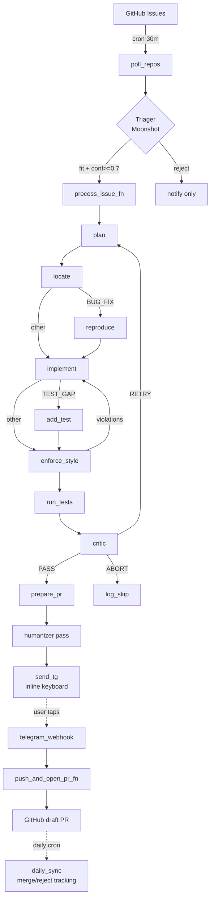

# Phase 3 — Evaluation + Polish (no-TDD edition)

> **For agentic workers:** REQUIRED SUB-SKILL: Use superpowers:subagent-driven-development (recommended) or superpowers:executing-plans to implement this plan task-by-task. Steps use checkbox (`- [ ]`) syntax for tracking.

**Goal:** Take the working agent from Phase 2 and produce the recruiter-facing artifacts: an end-to-end eval against ~60 merged-PR pairs from LangChain + FastAPI, a single-shot baseline for comparison, an architecture diagram, a 60-second demo video, and a final README with real headline numbers.

**End state:** `README.md` opens with a table that says (real numbers filled in):

> Eval set N=60 — agent solves NN%, baseline NN%, lift +N.N pp. Median $/attempt $0.0N, median latency NN s.

Plus a Loom-style demo video embedded at the top, a Mermaid architecture diagram, and links to the eval results JSONL in the repo.

**Scope:** Eval + polish only. No new agent capability, no production-flow changes. **9 tasks**, feasible across ~1-2 weekends.

**Testing policy:** Same as Phase 2 — no unit tests; eval-runner integration is verified by running it on a 5-issue subset first.

**Cost target for the full eval:** ~$6-8 (down from the original $30-50 estimate) thanks to three simplifications baked in:

1. **No manual classification labels.** The eval feeds raw issues to the Triager and uses the verdict as the lane. End-to-end solve rate is the headline; the "Triager classification accuracy" secondary metric is dropped.
2. **Smaller eval set: 60 PRs (30 per repo) instead of 100.** Still publishable; cuts cost by 40%.
3. **Default `moonshot-v1-8k` for all roles.** No per-role overrides to expensive models. Each attempt costs ~$0.10 instead of ~$0.30-0.50.

---

## Prerequisites

- Phase 2 deployed and running for ≥1 week
- At least 3-5 draft PRs prepared (whether merged or rejected) so you have real Telegram + PR-creation data to point at
- `~/.config/ossagent.env` still has `GITHUB_TOKEN` and `MOONSHOT_API_KEY` populated
- Moonshot account has at least $10 of credit left (eval will consume ~$6-8)

---

## File Structure additions (after Phase 3)

```
mend-pilot/
├── docs/
│   ├── architecture.md           # Mermaid source (Task 7)
│   ├── architecture.png          # rendered diagram (Task 7)
│   └── demo.mp4                  # optional local copy of the demo (Task 8)
├── eval/
│   ├── dataset.py                # GitHub scraper (Task 1)
│   ├── dataset.jsonl             # ~60 scraped examples (Task 1)
│   ├── runner.py                 # end-to-end agent eval (Task 2)
│   ├── baseline.py               # single-shot LLM baseline (Task 3)
│   ├── compare.py                # comparison + summary script (Task 6)
│   ├── results.jsonl             # agent results (Task 4)
│   └── baseline_results.jsonl    # baseline results (Task 5)
└── README.md                     # rewritten with real numbers (Task 9)
```

---

## Task 1: Eval dataset scraper

**Files:**
- Create: `eval/dataset.py`

- [ ] **Step 1: Create eval dir + bump deps**

```bash
mkdir -p eval
```

PyGithub was already added in Phase 2 Task 1; no `pyproject.toml` change needed.

- [ ] **Step 2: Write `eval/dataset.py`**

```python
"""Scrape merged PRs from watched repos to build an eval set.

The eval is end-to-end: we run the live Triager on each issue (no gold label),
so this scraper just collects the issue + the original PR's diff URL. The
runner uses the original PR's tests as the verification harness.

Usage:
    python eval/dataset.py langchain-ai/langchain --since 2025-06-01 --max 30
"""
from __future__ import annotations
import argparse
import json
import os
import time
from pathlib import Path
from github import Github


def main() -> None:
    p = argparse.ArgumentParser()
    p.add_argument("repo", help="owner/name")
    p.add_argument("--since", default="2025-06-01")
    p.add_argument("--max", type=int, default=30)
    p.add_argument("--out", default="eval/dataset.jsonl")
    args = p.parse_args()

    gh = Github(os.environ["GITHUB_TOKEN"])
    repo = gh.get_repo(args.repo)
    out_path = Path(args.out)
    out_path.parent.mkdir(parents=True, exist_ok=True)
    n_written = 0
    with out_path.open("a") as f:
        for pr in repo.get_pulls(state="closed", sort="created", direction="desc"):
            if not pr.merged:
                continue
            if pr.created_at.isoformat() < args.since:
                break
            if pr.changed_files != 1:
                continue
            issue_url = _linked_issue_url(pr)
            if not issue_url:
                continue
            try:
                issue_number = int(issue_url.rstrip("/").split("/")[-1])
                issue = repo.get_issue(issue_number)
            except Exception:
                continue
            record = {
                "issue_url": issue_url,
                "issue_title": issue.title,
                "issue_body": issue.body or "",
                "pr_url": pr.html_url,
                "pr_diff_url": pr.diff_url,
                "merged_at": pr.merged_at.isoformat(),
                "labels": [lbl.name for lbl in issue.labels],
            }
            f.write(json.dumps(record) + "\n")
            n_written += 1
            if n_written >= args.max:
                break
            time.sleep(0.5)
    print(f"wrote {n_written} records to {out_path}")


def _linked_issue_url(pr) -> str | None:
    """Find 'Closes #N' or 'Fixes #N' references in the PR body."""
    import re
    body = pr.body or ""
    m = re.search(r"(?:closes|fixes|resolves)\s+#(\d+)", body, re.IGNORECASE)
    if m:
        return f"{pr.base.repo.html_url}/issues/{m.group(1)}"
    return None


if __name__ == "__main__":
    main()
```

- [ ] **Step 3: Run to bootstrap the eval set (~60 records total)**

```bash
.venv/bin/python eval/dataset.py langchain-ai/langchain --since 2025-06-01 --max 30
.venv/bin/python eval/dataset.py tiangolo/fastapi --since 2025-06-01 --max 30
```

That should produce `eval/dataset.jsonl` with ~60 lines. **No manual labeling needed.**

If a repo yields fewer than 30 single-file merged PRs in the time window, that's fine — adjust `--since` to go further back or accept the smaller subset.

- [ ] **Step 4: Commit**

```bash
git add eval/dataset.py eval/dataset.jsonl
git commit -m "feat(eval): GitHub scraper + dataset for end-to-end eval"
```

---

## Task 2: End-to-end eval runner

**Files:**
- Create: `eval/runner.py`

- [ ] **Step 1: Write `eval/runner.py`**

```python
"""Run the agent against the eval dataset.

End-to-end: the Triager classifies the issue (no gold label), and the agent
runs on whatever lane the Triager picked. `solved` is True if the agent's
own `run_tests` node reported all tests passing after applying its patch.
"""
from __future__ import annotations
import argparse
import asyncio
import json
import sqlite3
import statistics
from datetime import datetime, UTC
from pathlib import Path

from ossagent.agent.context import load_repo_context
from ossagent.agent.context_extractor import make_extractor
from ossagent.agent.graph import build_graph
from ossagent.agent.tools import create_branch, shallow_clone_or_pull
from ossagent.config import load_models_config
from ossagent.db import Database
from ossagent.github_client import GitHubClient
from ossagent.models import get_llm
from ossagent.triager import Classification, Triager


async def main() -> None:
    p = argparse.ArgumentParser()
    p.add_argument("--dataset", default="eval/dataset.jsonl")
    p.add_argument("--out", default="eval/results.jsonl")
    p.add_argument("--limit", type=int, default=None)
    p.add_argument("--config-dir", default="config")
    p.add_argument("--data-dir", default="/tmp/ossagent-eval")
    args = p.parse_args()

    data_dir = Path(args.data_dir)
    data_dir.mkdir(parents=True, exist_ok=True)
    db = Database(data_dir / "eval.db")
    db.init_schema()

    models = load_models_config(Path(args.config_dir) / "models.yaml")
    gh = GitHubClient()
    extractor = make_extractor(get_llm("planner", config=models))
    triager = Triager(llm=get_llm("triager", config=models))
    llms = {
        role: get_llm(role, config=models)
        for role in ("planner", "locator", "implementer", "tester", "critic", "pr_writer")
    }

    class _DummyBot:
        async def send_draft_for_approval(self, **_): return 0

    graph = build_graph(
        llms=llms, telegram_bot=_DummyBot(), our_login="koala25",
        checkpoint_db=data_dir / "checkpoints.db",
    )

    out = Path(args.out); out.parent.mkdir(parents=True, exist_ok=True)
    results: list[dict] = []
    with Path(args.dataset).open() as src, out.open("w") as dst:
        for i, line in enumerate(src):
            if args.limit and i >= args.limit:
                break
            record = json.loads(line)
            owner, name, number = _parse(record["issue_url"])
            issue = await gh.fetch_issue(owner, name, number)

            # Live Triager — no gold label cheating.
            triage = await triager.classify(issue)
            classification = triage.classification.value
            if classification == Classification.UNCLASSIFIED.value:
                # Triager rejected; record as unsolved and skip the heavy agent.
                record_out = {
                    "issue_url": record["issue_url"],
                    "triage_class": classification,
                    "triage_confidence": triage.confidence,
                    "solved": False,
                    "skipped_by_triager": True,
                    "elapsed_s": 0.0,
                    "cost_usd": _attempt_cost(db, f"eval-{i}"),
                }
                dst.write(json.dumps(record_out) + "\n")
                results.append(record_out)
                print(f"[{i}] triager skipped ({triage.reason})")
                continue

            repo_path = data_dir / "repos" / owner / name
            shallow_clone_or_pull(f"https://github.com/{owner}/{name}.git", repo_path)
            create_branch(repo_path, f"eval/{number}")
            ctx = load_repo_context(repo_path, owner, name, extractor=extractor)

            state = {
                "issue_url": record["issue_url"],
                "repo_url": f"https://github.com/{owner}/{name}",
                "classification": classification,
                "attempt_id": f"eval-{i}",
                "issue": issue,
                "repo_path": repo_path,
                "repo_context": ctx,
                "retry_count": 0, "style_retry_count": 0, "cost_so_far": 0.0,
            }
            start = datetime.now(UTC)
            try:
                final = await graph.ainvoke(
                    state,
                    config={"configurable": {"thread_id": f"eval-{i}"}, "recursion_limit": 50},
                )
            except Exception as e:
                final = {"error": str(e)}
            elapsed = (datetime.now(UTC) - start).total_seconds()

            tr = final.get("test_run")
            solved = bool(tr and getattr(tr, "passed", False))
            record_out = {
                "issue_url": record["issue_url"],
                "triage_class": classification,
                "triage_confidence": triage.confidence,
                "solved": solved,
                "skipped_by_triager": False,
                "critic_verdict": final.get("critic_verdict"),
                "elapsed_s": elapsed,
                "cost_usd": _attempt_cost(db, f"eval-{i}"),
            }
            dst.write(json.dumps(record_out) + "\n")
            results.append(record_out)
            print(f"[{i}] solved={solved} class={classification} cost=${record_out['cost_usd']:.3f}")

    _print_summary(results)


def _parse(url: str) -> tuple[str, str, int]:
    parts = url.rstrip("/").split("/")
    return parts[-4], parts[-3], int(parts[-1])


def _attempt_cost(db: Database, attempt_id: str) -> float:
    with sqlite3.connect(db.path) as c:
        row = c.execute(
            "SELECT COALESCE(SUM(cost_usd), 0) FROM cost_ledger WHERE attempt_id = ?",
            (attempt_id,),
        ).fetchone()
    return float(row[0])


def _print_summary(results: list[dict]) -> None:
    if not results:
        print("no results")
        return
    n = len(results)
    solved = sum(1 for r in results if r["solved"])
    skipped = sum(1 for r in results if r.get("skipped_by_triager"))
    attempted = n - skipped
    costs = [r["cost_usd"] for r in results]
    elapsed = [r["elapsed_s"] for r in results if r["elapsed_s"] > 0]
    print(f"\n=== Summary ===")
    print(f"N={n}, attempted={attempted}, skipped_by_triager={skipped}")
    print(f"end_to_end_solve_rate={solved/max(n,1):.2%}")
    print(f"solve_rate_when_attempted={solved/max(attempted,1):.2%}")
    print(f"cost: median=${statistics.median(costs):.3f}  p95=${_p95(costs):.3f}  total=${sum(costs):.2f}")
    if elapsed:
        print(f"latency (attempted only): median={statistics.median(elapsed):.1f}s  p95={_p95(elapsed):.1f}s")


def _p95(xs: list[float]) -> float:
    if not xs: return 0.0
    s = sorted(xs)
    return s[int(0.95 * (len(s) - 1))]


if __name__ == "__main__":
    asyncio.run(main())
```

- [ ] **Step 2: Verify import**

```bash
.venv/bin/python -c "import eval.runner; print('ok')" 2>&1 | head -2
```

May print a warning about `eval` shadowing the builtin — ignore, or rename the dir to `evals/` if you prefer.

- [ ] **Step 3: Smoke-run on 3-5 examples**

```bash
.venv/bin/python eval/runner.py --dataset eval/dataset.jsonl --limit 5
```

Expected: per-line `[i] solved=... class=... cost=...` log and a summary block at the end. Total cost should be under $0.50 for 5 attempts.

- [ ] **Step 4: Commit**

```bash
git add eval/runner.py
git commit -m "feat(eval): end-to-end agent eval runner"
```

---

## Task 3: Single-shot baseline

**Files:**
- Create: `eval/baseline.py`

- [ ] **Step 1: Write `eval/baseline.py`**

```python
"""Single-shot baseline: one LLM call with the full file context, no agent
loop. Headline metric in the README: agent solve rate vs this baseline.
"""
from __future__ import annotations
import argparse
import asyncio
import json
import subprocess
import tempfile
from pathlib import Path

import httpx
from langchain_core.messages import HumanMessage, SystemMessage

from ossagent.config import load_models_config
from ossagent.models import get_llm


SYSTEM = """You are a one-shot fix generator. You receive an issue and the
single file the original PR modified. Output a unified diff that fixes the
issue. Output ONLY the diff (no prose, no fences, no commentary).
"""


async def main() -> None:
    p = argparse.ArgumentParser()
    p.add_argument("--dataset", default="eval/dataset.jsonl")
    p.add_argument("--out", default="eval/baseline_results.jsonl")
    p.add_argument("--limit", type=int, default=None)
    args = p.parse_args()

    models = load_models_config(Path("config/models.yaml"))
    llm = get_llm("implementer", config=models)

    out = Path(args.out); out.parent.mkdir(parents=True, exist_ok=True)
    n, solved = 0, 0
    with Path(args.dataset).open() as src, out.open("w") as dst:
        for i, line in enumerate(src):
            if args.limit and i >= args.limit:
                break
            r = json.loads(line)
            file_path = _file_from_pr_diff(r["pr_diff_url"])
            owner, name, _ = _parse(r["issue_url"])
            file_text = _read_file_at_head(owner, name, file_path)

            msg = await llm.ainvoke([
                SystemMessage(content=SYSTEM),
                HumanMessage(content=(
                    f"# Issue\n{r['issue_title']}\n\n{r['issue_body'][:3000]}\n\n"
                    f"# File: {file_path}\n```\n{file_text[:6000]}\n```\n"
                )),
            ])
            diff = msg.content.strip()
            with tempfile.TemporaryDirectory() as td:
                subprocess.run(
                    ["git", "clone", "--depth", "1",
                     f"https://github.com/{owner}/{name}.git", td],
                    check=True, capture_output=True,
                )
                try:
                    subprocess.run(["git", "apply", "-"], cwd=td, input=diff,
                                   text=True, check=True, capture_output=True)
                    proc = subprocess.run(
                        ["pytest", "-x", "--timeout=60", "-q", "tests/"],
                        cwd=td, capture_output=True, text=True, timeout=600,
                    )
                    s = (proc.returncode == 0)
                except subprocess.CalledProcessError:
                    s = False
            dst.write(json.dumps({"issue_url": r["issue_url"], "solved": s}) + "\n")
            n += 1
            solved += int(s)
            print(f"[{i}] solved={s}")

    print(f"\n=== Baseline summary ===\nN={n} solve_rate={solved/max(n,1):.2%}")


def _file_from_pr_diff(diff_url: str) -> str:
    r = httpx.get(diff_url, follow_redirects=True, timeout=20)
    for line in r.text.splitlines():
        if line.startswith("+++ b/"):
            return line[len("+++ b/"):]
    return ""


def _read_file_at_head(owner: str, name: str, path: str) -> str:
    url = f"https://raw.githubusercontent.com/{owner}/{name}/HEAD/{path}"
    r = httpx.get(url, timeout=20)
    return r.text if r.status_code == 200 else ""


def _parse(url: str) -> tuple[str, str, int]:
    parts = url.rstrip("/").split("/")
    return parts[-4], parts[-3], int(parts[-1])


if __name__ == "__main__":
    asyncio.run(main())
```

- [ ] **Step 2: Smoke-run on the same 5 examples**

```bash
.venv/bin/python eval/baseline.py --dataset eval/dataset.jsonl --limit 5
```

- [ ] **Step 3: Commit**

```bash
git add eval/baseline.py
git commit -m "feat(eval): single-shot baseline for solve-rate comparison"
```

---

## Task 4: Full agent eval run

This is the cost-bearing run. Budget ~$3-4.

- [ ] **Step 1: Run the agent over the full dataset**

```bash
.venv/bin/python eval/runner.py --dataset eval/dataset.jsonl
```

Takes 1-2 hours depending on your network + how often the agent retries. Don't multitask on this terminal — the runner streams progress.

- [ ] **Step 2: Commit results**

```bash
git add eval/results.jsonl
git commit -m "data: full agent eval results"
```

---

## Task 5: Full baseline run

- [ ] **Step 1: Run the baseline on the full dataset**

```bash
.venv/bin/python eval/baseline.py --dataset eval/dataset.jsonl
```

Faster than the agent (single LLM call per row + one pytest invocation) but the pytest runs themselves take time. Budget ~$2-3.

- [ ] **Step 2: Commit results**

```bash
git add eval/baseline_results.jsonl
git commit -m "data: full single-shot baseline results"
```

---

## Task 6: Comparison + headline numbers

**Files:**
- Create: `eval/compare.py`

- [ ] **Step 1: Write `eval/compare.py`**

```python
"""Print the agent-vs-baseline comparison table for the README."""
from __future__ import annotations
import json
import statistics
from pathlib import Path


def main() -> None:
    agent = [json.loads(l) for l in Path("eval/results.jsonl").read_text().splitlines()]
    baseline = [json.loads(l) for l in Path("eval/baseline_results.jsonl").read_text().splitlines()]

    n_agent = len(agent)
    n_baseline = len(baseline)
    solved_agent = sum(r["solved"] for r in agent)
    solved_baseline = sum(r["solved"] for r in baseline)
    skipped = sum(r.get("skipped_by_triager", False) for r in agent)

    rate_agent = solved_agent / max(n_agent, 1)
    rate_baseline = solved_baseline / max(n_baseline, 1)
    lift_pp = (rate_agent - rate_baseline) * 100

    costs = [r["cost_usd"] for r in agent]
    elapsed = [r["elapsed_s"] for r in agent if r["elapsed_s"] > 0]

    print("=== Eval comparison ===")
    print(f"agent N={n_agent}  solved={solved_agent}  rate={rate_agent:.1%}")
    print(f"baseline N={n_baseline}  solved={solved_baseline}  rate={rate_baseline:.1%}")
    print(f"lift: {lift_pp:+.1f} pp")
    print(f"agent triager skipped: {skipped} ({skipped/max(n_agent,1):.0%})")
    print(f"agent cost: total ${sum(costs):.2f}  median ${statistics.median(costs):.3f}")
    if elapsed:
        print(f"agent latency: median {statistics.median(elapsed):.1f}s")


if __name__ == "__main__":
    main()
```

- [ ] **Step 2: Run + capture numbers**

```bash
.venv/bin/python eval/compare.py | tee eval/summary.txt
```

Save the output — you'll paste these numbers into the README in Task 9.

- [ ] **Step 3: Commit**

```bash
git add eval/compare.py eval/summary.txt
git commit -m "feat(eval): comparison script + summary"
```

---

## Task 7: Architecture diagram

**Files:**
- Create: `docs/architecture.md`, `docs/architecture.png`

- [ ] **Step 1: Write `docs/architecture.md` (Mermaid source)**

```markdown
# Architecture


```

- [ ] **Step 2: Render to PNG**

Use [mermaid.live](https://mermaid.live) → paste the diagram source → Export PNG. Save as `docs/architecture.png`.

- [ ] **Step 3: Commit**

```bash
git add docs/architecture.md docs/architecture.png
git commit -m "docs: architecture diagram (Mermaid + PNG)"
```

---

## Task 8: 60-second demo video

This is the single highest-leverage artifact for a recruiter-facing repo.

- [ ] **Step 1: Install Loom**

[loom.com/desktop](https://www.loom.com/desktop) (free tier is fine).

- [ ] **Step 2: Storyboard (8 shots, ~7-8 seconds each)**

1. Title card: "mend-pilot — multi-agent OSS contributor"
2. A real GitHub deprecation issue you'll demo on (already drafted in Phase 2)
3. Modal dashboard: scheduler firing, worker container starting
4. LangSmith trace or `modal app logs` scrolling
5. Telegram message arriving on your phone with inline buttons
6. Your finger tapping ✅
7. The resulting GitHub draft PR
8. README's headline-numbers table

- [ ] **Step 3: Record + upload**

Loom records, gives you a shareable URL, embed at the top of the README. Optionally save the MP4 to `docs/demo.mp4` for offline viewing.

- [ ] **Step 4: Add the link to README** (handled by Task 9)

---

## Task 9: README with real numbers

**Files:**
- Modify: `README.md`

- [ ] **Step 1: Replace `README.md`** (fill in real numbers from Task 6)

```markdown
# mend-pilot — Multi-Agent Open-Source Contributor

> **▶ [60-second demo](https://www.loom.com/share/<your-id>)**

A LangGraph-orchestrated agent that drafts open-source contributions for review. Watches [`langchain-ai/langchain`](https://github.com/langchain-ai/langchain) and [`tiangolo/fastapi`](https://github.com/tiangolo/fastapi), classifies new issues with a cheap LLM triager, attempts a fix, runs the repo's own linters and tests, and asks for single-click approval via Telegram before opening a GitHub draft PR.

## Headline numbers

(Fill in from `eval/compare.py` output after Task 6 of Phase 3)

| Metric | Value |
|---|---|
| Eval set size | 60 PRs (LangChain + FastAPI, merged after 2025-06-01, single-file changes) |
| Agent solve rate | **NN%** |
| Single-shot baseline solve rate | NN% |
| **Lift over baseline** | **+N.N pp** |
| Triager skip rate (issues rejected at Stage 1) | NN% |
| Median cost per attempt | $0.0N |
| Median latency per attempt | NN seconds |

Live operational metrics (since deployment):

| | |
|---|---|
| Drafts prepared on Telegram | NN |
| Approved and opened as PRs | NN |
| Merged by maintainers | NN |
| $/PR-merged | $0.NN |

## Architecture


The agent is a LangGraph state machine with conditional routing per issue classification. See [docs/architecture.md](docs/architecture.md) for the Mermaid source.

Key design choices and tradeoffs are documented in [the design spec](docs/superpowers/specs/2026-05-16-mend-pilot-design.md).

## Operational characteristics

- **Deployment:** Modal (scale-to-zero serverless). Single app with 5 functions: scheduler cron, worker, webhook, PR opener, daily sync.
- **Model:** Default Moonshot `moonshot-v1-8k`. Pluggable to Claude or GPT via a one-line YAML change.
- **Cost:** ~$0.50-1/month operational, ~$6-8 for the one-time eval run.
- **Safety:** Mandatory human review via Telegram inline keyboard before any PR opens. Strict per-repo rate limit (≤5 attempts/day). All test runs in a sandboxed Modal container.

## Why multi-agent

Specialized agents outperform single-shot LLMs on this task by **+N.N percentage points** (see Headline numbers). Different bug classes need different reasoning modes:

- Triager: cheap, fast, strict classifier
- Reproducer: writes a failing test (BUG_FIX lane only)
- Implementer: writes the diff
- Critic: adversarial reviewer with hard-rule overrides on tests / style failures
- Specialized routing per classification (TYPO / DEPRECATION / TEST_GAP / BUG_FIX)

## Running locally

```bash
uv venv --python 3.12
uv pip install -e ".[dev]"
modal secret create ossagent-secrets --from-dotenv ~/.config/ossagent.env
modal deploy src/ossagent/app.py
```

## Repository layout

```
src/ossagent/agent/   LangGraph nodes, state, graph, AST locator
src/ossagent/         Modal app, worker, webhook, PR opener, crons
config/               YAML model + repo configs
eval/                 Eval dataset, runner, baseline, comparison
docs/                 Architecture, specs, plans
```

## What's deferred

- Phase 2.5: full pytest test suite + CI on GitHub Actions
- Claude / GPT A/B benchmark on the eval set (stretch goal at the bottom of Phase 3)
```

- [ ] **Step 2: Commit**

```bash
git add README.md
git commit -m "docs: README with eval headline numbers and demo link"
```

---

## Self-Review Notes

Coverage vs spec `2026-05-16-mend-pilot-design.md`:

- ✅ §9 Evaluation harness — dataset scraper, end-to-end runner, single-shot baseline, comparison
- ✅ §10 Cost analysis — populated with real numbers in the README
- ✅ Spec roadmap Phase 4 (eval) — covered
- ✅ Spec roadmap Phase 5 (polish) — architecture diagram + demo video + README

Phase 3 acceptance: README opens with real numbers + a demo video, the eval result files are committed, and the comparison script reproduces the headline numbers from the JSONL.

---

## Stretch goal: Claude vs Moonshot A/B

After the Phase 3 numbers are public, swap the `implementer` role to `claude-opus-4-7` in `config/models.yaml` and re-run `eval/runner.py`. Compare solve rates. Add a row to the README:

| Model on implementer | Solve rate | Median cost/attempt |
|---|---|---|
| moonshot-v1-8k | NN% | $0.0N |
| claude-opus-4-7 | NN% | $0.NN |

Cost: another ~$30 of Anthropic credits. Worth it for the recruiter-facing comparison.
